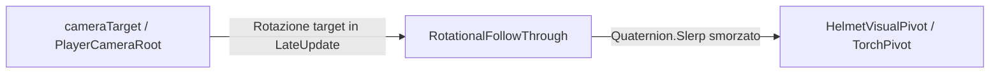

# Camera & Visual Follow-Through
Ultima verifica: 2026-09-12

## Scopo e confini
Gestisce il ritardo e l'inerzia rotazionale (lag/follow-through) per elementi solidali alla visuale del diver, come la visiera del casco e la torcia.
Simula il peso e la massa di uno scafandro da palombaro e della torcia subacquea pesante: quando la visuale o il corpo ruotano rapidamente, questi oggetti non ruotano istantaneamente insieme alla camera ma inseguono con un ritardo angolare controllato.

## File e componenti
- `Assets/_Project/Code/Player/Camera/RotationalFollowThrough.cs`: Componente generalizzato per ritardo rotazionale su yaw/pitch con stato quaternion indipendente e clamping angolare massimo.
- `Assets/_Project/Code/Player/Camera/TorchFollowThrough.cs`: Implementazione preesistente dedicata all'inseguimento morbido della torcia. Conservata per retrocompatibilità con scene/prefab precedenti.

## Dipendenze e flusso dati
- **Lead Transform**: Dipende da una Transform sorgente di guida (tipicamente `PlayerCameraRoot` o la Main Camera).
- **Execution Order**: Viene aggiornato in `LateUpdate()` per calcolare lo sfasamento dopo che il movimento e la rotazione del diver/camera sono stati risolti.
- **Stato Quaternion Interno**: Mantiene uno stato di rotazione indipendente evitando che la rotazione del parent azzeri l'accumulo angolare nel frame.

## Componenti

### RotationalFollowThrough
- **Responsabilità e ciclo di vita**:
  - `Awake()`: Se `leadTransform` non è assegnato, tenta di ricavarlo dal `transform.parent`. Inizializza `currentRotation` alla rotazione corrente.
  - `LateUpdate()`: Calcola la rotazione target da `leadTransform`, interpola sfericamente (`Quaternion.Slerp`) verso il target in base a `horizontalLag`, e limita l'angolo massimo di sfasamento tramite `Quaternion.RotateTowards` con `maxLagAngle`.
- **Campi Inspector**:
  - `Transform leadTransform` (default: `null`): Transform di riferimento da inseguire.
  - `float horizontalLag` (default: `10f`): Velocità di inseguimento / smorzamento orizzontale.
  - `float verticalLag` (default: `8f`): Velocità di inseguimento / smorzamento verticale.
  - `float maxLagAngle` (default: `15f`): Angolo massimo in gradi di deviazione prima di forzare il riallineamento.
  - `float returnSpeed` (default: `14f`): Velocità di ritorno verso il centro.
- **API pubbliche**:
  - Nessuna API pubblica esposta; opera come controller autonomo nel ciclo di vita `LateUpdate`.
- **Riferimenti obbligatori e comportamento se mancanti**:
  - `leadTransform`: Se nullo in `Awake()`, viene impostato a `transform.parent`. Se anche il parent è assente, disabilita il comportamento.

### TorchFollowThrough
- **Responsabilità e ciclo di vita**:
  - `Awake()`: Fallback su `transform.parent` se `leadTransform` è nullo.
  - `LateUpdate()`: Applica `Quaternion.Slerp` con `followSpeed * Time.deltaTime` e vincola l'offset con `maxAngleOffset`.
- **Campi Inspector**:
  - `Transform leadTransform`: Transform da inseguire.
  - `float followSpeed` (default: `12f`): Velocità di interpolazione.
  - `float maxAngleOffset` (default: `18f`): Deviazione massima tollerata in gradi.
- **Riferimenti obbligatori e comportamento se mancanti**:
  - Se `leadTransform` è nullo e il componente non ha parent, genera warning e si disabilita.

## Setup in Unity
1. Posizionare un GameObject pivot figlio del diver (es. `HelmetVisualPivot` o `TorchPivot`).
2. Aggiungere il componente `RotationalFollowThrough` al pivot.
3. Assegnare il `PlayerCameraRoot` al campo `Lead Transform`.
4. Posizionare le mesh grafiche (visiera, torcia) come figlie di questo pivot.

## Configurazione verificata in prefab e scene
- In [Player.prefab](file:///Z:/_PROJECTS/Unity/Project_Deep/Assets/_Project/Prefabs/Player.prefab):
  - Il nodo `HelmetVisualPivot` ha `RotationalFollowThrough` con `leadTransform` collegato a `PlayerCameraRoot`.
  - Il nodo `TorchPivot` gestisce la torcia mantenendo il lag rispetto alla visuale per accentuare la claustrofobia dell'abisso.

## Estensione del sistema
- Aggiunta di sway laterale/rollio durante i passi agganciandosi all'evento `OnFootstep` di `DiverController`.

## Limiti e problemi noti
- Se il pivot si trova nella stessa gerarchia di Cinemachine, un'inversione nell'ordine di esecuzione dei `LateUpdate` può produrre jitter visivo. Si consiglia di mantenere i nodi grafici follow-through su pivot dedicati non controllati direttamente da Cinemachine.

## Sistemi collegati
- [PlayerMovement.md](file:///Z:/_PROJECTS/Unity/Project_Deep/documentation/PlayerMovement.md)
- [Flashlight.md](file:///Z:/_PROJECTS/Unity/Project_Deep/documentation/Flashlight.md)
