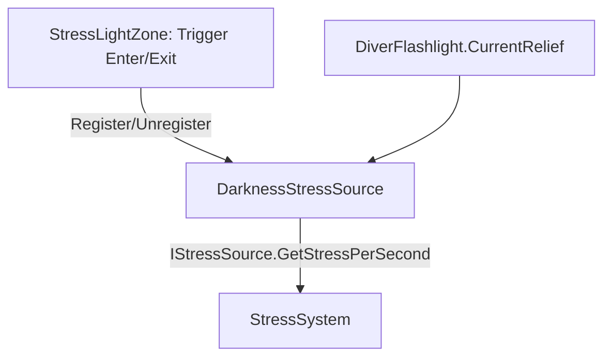

# Darkness Stress
Ultima verifica: 2026-09-12

## Scopo e confini
Rende l'oscurità la condizione ambientale di baseline di *Deeplonauts*. Fuori dalle isole luminose artificiali o naturali, il diver accumula stress continuo; le zone illuminate e la torcia personale (`DiverFlashlight`) forniscono sollievo graduale.
Il sistema evita il campionamento fotometrico a runtime: si basa su collider trigger espliciti (`StressLightZone`) e sullo stato della torcia, garantendo al level designer un controllo puntuale delle oasi di sicurezza senza appesantire la pipeline di rendering.

## File e componenti
- `Assets/_Project/Code/Player/Stress/DarknessStressSource.cs`: Sorgente di stress ambientale che implementa `IStressSource`, gestisce la lista di zone luminose attive e legge il sollievo della torcia.
- `Assets/_Project/Code/Environment/StressLightZone.cs`: Trigger volumetrico che rappresenta un'isola di luce e notifica il suo valore di `stressRelief` alla sorgente del player.

## Dipendenze e flusso dati
- **Luce Ambientale vs Player**: `DarknessStressSource` confronta il massimo sollievo tra le `StressLightZone` attive (`currentLightRelief`) e il sollievo della torcia (`flashlight.CurrentRelief`), calcolando `EffectiveLightRelief`.
- **Stress Aggregator**: Espone `GetStressPerSecond()` per `StressSystem` tramite l'interfaccia `IStressSource`.
- **Interpolazione temporale**: Le transizioni di sollievo sono smorzate esponenzialmente tramite `lightTransitionSpeed`.

## Componenti

### DarknessStressSource
- **Responsabilità e ciclo di vita**:
  - `Awake()`: Tenta di risolvere il riferimento a `DiverFlashlight` (cerca sullo stesso GameObject, nel parent o nei figli).
  - `Update()`: Rimuove eventuali zone distrutte o disabilitate, estrae il valore massimo di sollievo tra le zone attive e interpola `currentLightRelief` verso questo target tramite `Mathf.Exp(-lightTransitionSpeed * Time.deltaTime)`.
- **Campi Inspector**:
  - `float darkStressPerSecond` (default: `8f`): Tasso di accumulo di stress al secondo nell'oscurità totale.
  - `float minimumStressPerSecond` (default: `0f`): Tasso residuo di stress in piena luce.
  - `float lightTransitionSpeed` (default: `2f`): Velocità esponenziale di convergenza del sollievo.
  - `float currentLightRelief` (range: 0-1, debug sola lettura): Sollievo ambientale smussato corrente.
  - `DiverFlashlight flashlight`: Riferimento alla torcia per combinare la luce portatile con l'ambiente.
- **API pubbliche**:
  - `float CurrentLightRelief { get; }`: Sollievo ambientale smussato.
  - `float EffectiveLightRelief { get; }`: Massimo tra sollievo ambientale e sollievo torcia.
  - `void RegisterLightZone(StressLightZone zone)`: Invocato all'ingresso in una zona luminosa.
  - `void UnregisterLightZone(StressLightZone zone)`: Invocato all'uscita dalla zona.
  - `float GetStressPerSecond()`: Se `EffectiveLightRelief >= 0.95f`, restituisce `minimumStressPerSecond` (0f), consentendo a `StressSystem` di avviare il recovery. Altrimenti interpola tra `darkStressPerSecond` e `minimumStressPerSecond`.
- **Riferimenti obbligatori e comportamento se mancanti**:
  - Se `flashlight` non è presente, il calcolo si basa esclusivamente sulle `StressLightZone`.

### StressLightZone
- **Responsabilità e ciclo di vita**:
  - `Awake()`: Verifica che `visualLight` sia assegnata; in caso contrario logga un errore e si disabilita per evitare discrepanze tra grafica e gameplay.
  - `OnDisable()`: Rimuove la registrazione da tutte le sorgenti collegate per prevenire memory leak o stati fantasma.
  - `OnTriggerEnter(Collider other)`: Cerca `DarknessStressSource` nel collider entrante (o nel parent) e lo registra.
  - `OnTriggerExit(Collider other)`: Deregistra la sorgente.
  - `OnValidate()`: Forza automaticamente `collider.isTrigger = true`.
- **Campi Inspector**:
  - `float stressRelief` (range: 0-1, default: `1f`): Quota di sollievo fornita dalla sorgente (1.0 = zona sicura, 0.5 = penombra).
  - `Light visualLight`: Riferimento alla luce visiva Unity associata al volume.
- **API pubbliche**:
  - `float StressRelief { get; }`

## Setup in Unity
1. Aggiungere `DarknessStressSource` al prefab Player o al GameObject con `StressSystem`.
2. Assegnare `DiverFlashlight` se non presente sullo stesso livello gerarchico.
3. Per creare una zona di luce sicura nella scena:
   - Creare un GameObject con `Light` e un `Collider` (es. `BoxCollider`).
   - Aggiungere `StressLightZone`.
   - Assegnare `visualLight` e impostare `stressRelief` (es. `1.0` per base/oasi, `0.5` per luci d'emergenza deboli).

## Configurazione verificata in prefab e scene
- Nella scena `Prototype.unity`:
  - `SafeLightZone`: Posizione `(-1, 2, -18)`, trigger `14 × 6 × 14`, `stressRelief = 1.0`.
  - `DimLightZone`: Posizione `(7, 2, -4)`, trigger `10 × 5 × 10`, `stressRelief = 0.5`.

## Estensione del sistema
- Zone a sollievo temporaneo: boe di segnalazione con timer o flare che distruggono o disabilitano la propria `StressLightZone` al consumo.

## Limiti e problemi noti
- Se il diver spegne la torcia in un'area non coperta da `StressLightZone`, `EffectiveLightRelief` scende a 0 e lo stress aumenta al ritmo di 8 unità/s.

## Verifica
- Entrando in `SafeLightZone` lo stress ambientale deve scendere a 0.
- Uscendo al buio e spegnendo la torcia (tasto F) lo stress deve risalire verso 8 unità/s.

## Sistemi collegati
- [Stress.md](file:///Z:/_PROJECTS/Unity/Project_Deep/documentation/Stress.md)
- [Flashlight.md](file:///Z:/_PROJECTS/Unity/Project_Deep/documentation/Flashlight.md)
- [Environment.md](file:///Z:/_PROJECTS/Unity/Project_Deep/documentation/Environment.md)
