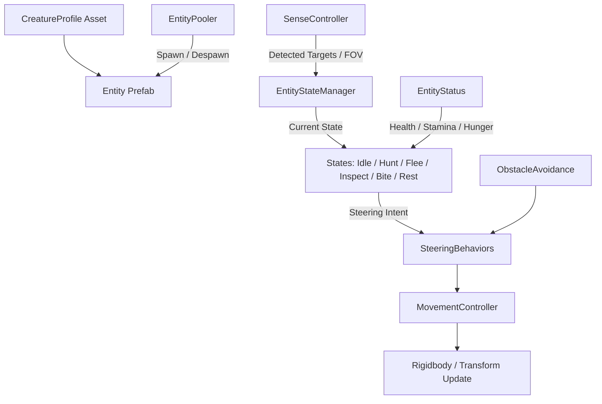

# Entity & Fauna System
Ultima verifica: 2026-09-12

## Scopo e confini
Simula la fauna sottomarina autonoma dell'abisso mediante un'architettura modulare guidata da dati (`CreatureProfile`), stati a macchina a stati finiti (`IEntityState`), percezione sensoriale 3D (`SenseController`), cinematica e steering idrodinamico con evitamento ostacoli (`MovementController`, `ObstacleAvoidance`, `SteeringBehaviors`) e allocazione a zero garbage collection via object pooling (`EntityPooler`).
Gestisce inoltre la classificazione ecologica delle entità (prede, predatori, neutrali, curiosi) e la relazione predatore-preda rispetto al giocatore (`PlayerStatus`, `PlayerProfile`).

## File e componenti
Il sistema risiede interamente in `Assets/_Project/Code/EntitySystem/` ed è composto da 22 script suddivisi nelle seguenti cartelle:

### Core & Spawning
1. `EntitySpawner.cs`: Spawner di creature su aree volumetriche 3D con integrazione diretta verso il pooler.
2. `Core/EntityPooler.cs`: Singleton per il riciclo e pooling delle entità con auto-despawn per distanza dal player.
3. `Core/EntityStateManager.cs`: Orchestratore della FSM (Finite State Machine) che gestisce ciclo di vita e transizioni degli stati.
4. `Core/EntityStatus.cs`: Traccia parametri vitali, stamina, fame, salute e stato biologico dell'entità.
5. `Core/PlayerStatus.cs`: Componente applicato al diver per esporre la sua minaccia ecologica, salute e appetibilità ai sensori della fauna.

### Movement & Steering
6. `Movement/MovementController.cs`: Controller fisico/cinematico che applica forze di steering, clamp di velocità e vincoli di profondità.
7. `Movement/ObstacleAvoidance.cs`: Rileva ostacoli con raycast/spherecast a ventaglio (whisker sensori) e genera forze repulsive.
8. `Movement/SteeringBehaviors.cs`: Libreria di metodi statici per il calcolo di forze di guida (Seek, Flee, Arrive, Wander, Separation, Obstacle Avoidance).

### Sensory & Perception
9. `Sensors/SenseController.cs`: Rileva entità nel campo visivo 3D (FOV conico) e prossimità sferica tramite `Physics.OverlapSphereNonAlloc`.

### Finite State Machine (States)
10. `States/IEntityState.cs`: Interfaccia comune per tutti gli stati comportamentali (`OnEnter`, `OnUpdate`, `OnFixedUpdate`, `OnExit`, `CheckTransitions`).
11. `States/IdleState.cs`: Nuoto erratico o stazionamento sul posto con recupero di stamina.
12. `States/HuntState.cs`: Inseguimento attivo di prede o del player con consumo di energia e accelerazione di caccia.
13. `States/FleeState.cs`: Fuga rapida nella direzione opposta alla minaccia/predatore.
14. `States/InspectState.cs`: Avvicinamento cauto e circospezione verso stimoli sconosciuti (es. luce torcia o diver).
15. `States/BiteState.cs`: Esecuzione dell'attacco morso a corto raggio con danno al target e animazione/impulso.
16. `States/RestState.cs`: Riposo immobile sul fondale o in anfratti quando la stamina è esaurita.

### Data Profiles & Enums
17. `ScriptableObjects/CreatureProfile.cs`: Definizione immutabile dei parametri di una specie marina (velocità, percezione, dieta, aggressione).
18. `ScriptableObjects/PlayerProfile.cs`: Profilo dei valori sensoriali e di minaccia del diver nei confronti della fauna.
19. `Enums/EntityEnums.cs`: Enum standard del sistema (`EntityType`, `EntityState`, `StatusType`, `MovementStyle`, `FovZone`).

### Debug & Tooling
20. `Debug/EntityDebugGizmos.cs`: Visualizzazione in Scene View di vettori di moto, FOV, target di caccia e collider.
21. `Debug/PlayerStatusGizmos.cs`: Visualizzazione del raggio di minaccia e percezione del player.
22. `Editor/CreatureProfileCreator.cs`: Menu editor (*Assets/Create/Deeploration/Creature Profile*) per creare istanze di profilo.

## Dipendenze e flusso dati
- **Sensory -> State Manager**: `SenseController` scansiona l'ambiente con `OverlapSphereNonAlloc` a intervalli regolari (`scanInterval`), classificando prede e predatori.
- **State Manager -> Active State**: `EntityStateManager` esegue `CheckTransitions()` e assegna il target a `MovementController`.
- **Active State -> Movement Controller**: Lo stato attivo richiede una combinazione di forze tramite `SteeringBehaviors` (es. `Seek` verso la preda, `Flee` dal predatore).
- **Movement Controller -> Physics / Transform**: `MovementController` somma le forze, applica `ObstacleAvoidance`, limita la quota tra `minDepth` e `maxDepth` e aggiorna la posizione/rotazione.
- **Entity Pooler -> Lifecycle**: All'avvio della scena `EntityPooler` crea i pool pre-allocati. `EntitySpawner` estrae le istanze; se un'entità supera `despawnDistance` dal player, si disattiva e rientra nel pool.

## Componenti Principali

### EntityStateManager
- **Responsabilità e ciclo di vita**:
  - `Awake()`: Registra i componenti dello stesso GameObject (`EntityStatus`, `SenseController`, `MovementController`). Inizializza il dizionario degli stati istanziando le classi implementatrici di `IEntityState`.
  - `Update()` / `FixedUpdate()`: Delega l'esecuzione allo stato attivo corrente ed esegue `CheckTransitions()`.
- **Campi Inspector**:
  - `EntityState initialState` (default: `EntityState.Idle`).
  - `EntityState currentState` (debug sola lettura).
- **API pubbliche**:
  - `event Action<EntityState, EntityState> OnStateChanged`: Notifica vecchia e nuova transizione.
  - `void ChangeState(EntityState newState)`: Esegue `OnExit()` dello stato uscente e `OnEnter()` del nuovo stato.
  - `EntityState CurrentState { get; }`

### SenseController
- **Responsabilità e ciclo di vita**:
  - Esegue periodicamente scansioni fisiche (`Physics.OverlapSphereNonAlloc`) usando il raggio di vista del `CreatureProfile`.
  - Verifica l'angolo visivo 3D (`Vector3.Angle`) e il raycast di linea di vista per escludere bersagli dietro rocce.
- **Campi Inspector**:
  - `CreatureProfile profile`: Parametri di vista e percezione.
  - `LayerMask detectionLayers`: Layer delle altre entità e del player.
  - `LayerMask obstacleLayers`: Layer che bloccano la linea di vista.
  - `float scanInterval` (default: `0.2f` secondi).
- **API pubbliche**:
  - `IReadOnlyList<Transform> DetectedPrey { get; }`
  - `IReadOnlyList<Transform> DetectedPredators { get; }`
  - `Transform NearestThreat { get; }`
  - `Transform NearestFood { get; }`
  - `bool IsPlayerVisible { get; }`

### MovementController
- **Responsabilità e ciclo di vita**:
  - `FixedUpdate()`: Calcola la velocità risultante applicando inerzia marina, drag, banking/rollio in curva e vincoli sui limiti verticali di profondità.
- **Campi Inspector**:
  - `CreatureProfile profile`: Limiti di velocità massima, accelerazione e forza di virata.
  - `Rigidbody rb`: Rigidbody associato (se presente, altrimenti moto cinematico).
- **API pubbliche**:
  - `void SetTarget(Vector3 position)`: Imposta la destinazione.
  - `void ApplySteeringForce(Vector3 force)`: Aggiunge una forza di accelerazione.
  - `Vector3 Velocity { get; }`

### EntityPooler
- **Responsabilità e ciclo di vita**:
  - `public static EntityPooler Instance { get; private set; }`
  - Pre-istanzia i pool di GameObject definiti in `PoolConfig` disabilitandoli all'avvio.
  - Verifica periodicamente la distanza di ciascuna entità attiva dal diver: se `distance > despawnDistance`, l'entità viene disattivata e riaccodata.
- **API pubbliche**:
  - `GameObject Spawn(EntityType type, Vector3 position, Quaternion rotation)`
  - `void Despawn(GameObject entity)`
  - `void DespawnAll()`

### EntityStatus
- **Campi e Proprietà**:
  - `float Health`, `float Stamina`, `float Hunger`.
  - `bool IsExhausted`, `bool IsDead`.
  - Eventi: `OnHealthChanged`, `OnStaminaDepleted`, `OnDeath`.

### PlayerStatus & PlayerProfile
- **PlayerStatus**: Collocato su `PlayerCapsule`, espone `ThreatLevel` e `PreyValue` per permettere alle creature marine di decidere se fuggire dal diver o attaccarlo.
- **PlayerProfile**: ScriptableObject con i parametri ecologici percepiti dal mondo animale sottomarino.

## Setup in Unity
1. **Prefab Creatura**:
   - GameObject con `EntityStatus`, `SenseController`, `MovementController`, `ObstacleAvoidance`, `EntityStateManager`, `SphereCollider`/`CapsuleCollider` e `EntityDebugGizmos`.
   - Assegnare un asset `CreatureProfile` coerente con la specie (pesce gregario, predatore abissale, spazzino).
2. **Scena**:
   - Inserire `EntityPooler` con configurate le dimensioni dei pool per ciascun `EntityType`.
   - Collocare `EntitySpawner` nell'area volumetrica per generare banchi o singoli predatori all'interno di volumi definiti.

## Configurazione verificata in prefab e scene
- Nella scena `Prototype.unity` (rimossa il 2026-10-07 nel commit `f0fb87b`, recuperabile dalla storia di Git; configurazione non riverificata dopo la rimozione):
  - `EntityPooler` e `EntitySpawner` sono presenti e operativi.
  - La visualizzazione gizmo in debug (`EntityDebugGizmos`) mostra i raggi di percezione e i vettori di steering.

## Estensione del sistema
- Creazione di un nuovo stato comportamentale: implementare `IEntityState`, aggiungere il valore corrispondente nell'enum `EntityState` in `EntityEnums.cs` e istanziarlo nel dizionario di `EntityStateManager`.
- Creazione di una nuova specie marina: tasto destro in Project -> *Create -> Deeploration -> Creature Profile*.

## Limiti e problemi noti
- Evitare di allocare array o liste temporanee in `SenseController.Update()`: il sistema deve usare costantemente buffer preallocati (`OverlapSphereNonAlloc`) per mantenere 0 allocazioni a regime.

## Sistemi collegati
- [PlayerMovement.md](file:///Z:/_PROJECTS/Unity/Project_Deep/documentation/PlayerMovement.md)
- [EditorTools.md](file:///Z:/_PROJECTS/Unity/Project_Deep/documentation/EditorTools.md)
