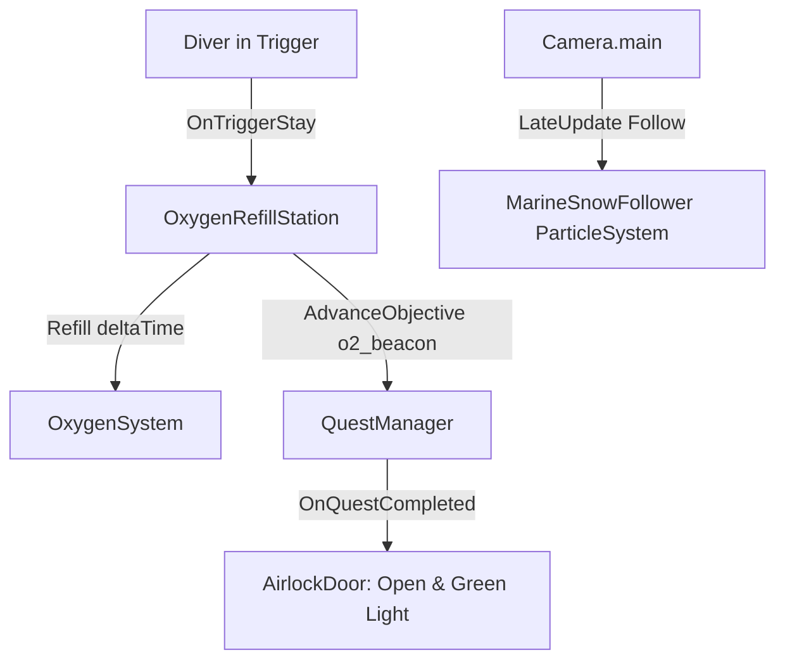

# Environment Systems
Ultima verifica: 2026-09-12

## Scopo e confini
Raggruppa gli elementi interattivi e atmosferici dell'ambiente di gioco non appartenenti alla fauna autonoma:
- Il portale stagno della base (`AirlockDoor`), che funge da passaggio di fine sezione legato agli obiettivi di missione.
- La stazione di rifornimento ossigeno (`OxygenRefillStation`), che ripristina la bombola del diver e avanza gli obiettivi di sopravvivenza.
- L'effetto atmosferico particellare della neve marina (`MarineSnowFollower`), ottimizzato per seguire il punto di vista del giocatore.
- Le isole di luce protetta (`StressLightZone`), documentate in dettaglio in [DarknessStress-docs.md](file:///Z:/_PROJECTS/Unity/Project_Deep/documentation/DarknessStress-docs.md).

## File e componenti
- `Assets/_Project/Code/Environment/AirlockDoor.cs`: Controller dell'apertura meccanica e dei segnali visivi del portale stagno della base DR-04.
- `Assets/_Project/Code/Environment/OxygenRefillStation.cs`: Ricaricatore continuo di O₂ per il diver in sosta sul trigger.
- `Assets/_Project/Code/Environment/MarineSnowFollower.cs`: Script ad esecuzione immediata (`ExecuteAlways`) che ancora il sistema particellare della neve marina davanti alla camera.
- `Assets/_Project/Code/Environment/StressLightZone.cs`: Trigger volumetrico di sollievo dallo stress (vedere [DarknessStress-docs.md](file:///Z:/_PROJECTS/Unity/Project_Deep/documentation/DarknessStress-docs.md)).

## Dipendenze e flusso dati
- **Progressione**: `AirlockDoor` si iscrive a `QuestManager.Instance.OnQuestCompleted` in `Start()`. All'apertura del portale si sposta verso `targetPosition`.
- **Ricarica O₂**: `OxygenRefillStation` rileva l'`OxygenSystem` sul diver e chiama `Refill(Time.deltaTime)` durante la permanenza nel trigger.
- **Rendering & Atmosfera**: `MarineSnowFollower` calcola in `LateUpdate()` la posizione delle particelle oceaniche in base alla posizione e rotazione della `Camera.main`.

## Componenti

### AirlockDoor
- **Responsabilità e ciclo di vita**:
  - `Awake()`: Salva `closedPosition = doorPanel.localPosition` e imposta la luce `doorStatusLight` su `lockedColor`.
  - `Start()` / `OnDestroy()`: Sottoscrive e disdice `QuestManager.Instance.OnQuestCompleted`. Se la quest è già completata all'avvio, apre immediatamente la porta.
  - `Update()`: Quando `isOpen` è vero, interpola `doorPanel.localPosition` verso `targetPosition` a velocità `openSpeed`.
- **Campi Inspector**:
  - `Light doorStatusLight`: Faretto di segnalazione sopra la porta.
  - `Transform doorPanel`: Paratia mobile della porta.
  - `Vector3 openOffset` (default: `(0f, 3.5f, 0f)`): Spostamento relativo del pannello all'apertura.
  - `float openSpeed` (default: `2f` m/s).
  - `Color lockedColor` (default: Rosso), `Color unlockedColor` (default: Verde).
  - `bool isOpen` (debug sola lettura).
- **API pubbliche**:
  - `void HandleQuestCompleted()`: Avvia l'apertura della paratia e colora la luce di verde.

### OxygenRefillStation
- **Responsabilità e ciclo di vita**:
  - Richiede un `Collider` con `isTrigger = true`.
  - `OnTriggerEnter(Collider other)`: Cerca `OxygenSystem`, notifica l'obiettivo `"o2_beacon"` a `QuestManager.Instance` se non ancora inviato, e cambia la luce del beacon in `activeColor`.
  - `OnTriggerStay(Collider other)`: Chiama `playerOxygen.Refill(Time.deltaTime)`.
  - `OnTriggerExit(Collider other)`: Ripristina la luce in `standbyColor` e azzera il riferimento al player.
- **Campi Inspector**:
  - `float refillRatePerSecond` (default: `10f`): Parametro locale (nota: la velocità effettiva di ricarica è determinata da `OxygenProfile.refillRatePerSecond`).
  - `string questObjectiveId` (default: `"o2_beacon"`).
  - `Light stationBeaconLight`: Faro di segnalazione della colonnina.
  - `Color standbyColor` (default: ambra/giallo), `Color activeColor` (default: ciano/verde).

### MarineSnowFollower
- **Responsabilità e ciclo di vita**:
  - `[ExecuteAlways]` per visualizzare il pulviscolo marino sia in Play Mode che nell'Editor.
  - `LateUpdate()`: Posiziona il Transform del sistema particellare a `target.position + target.rotation * offset`.
- **Campi Inspector**:
  - `Transform target`: Camera da seguire (se nullo, individua `Camera.main`).
  - `Vector3 offset` (default: `(0f, 1f, 3f)`): Offset locale davanti agli occhi del diver.

## Setup in Unity
1. **Airlock**:
   - Creare un GameObject con la paratia mobile `doorPanel` e una luce `doorStatusLight`.
   - Aggiungere `AirlockDoor` e verificare che sia presente `QuestManager` in scena.
2. **Stazione O₂**:
   - Creare la mesh della colonnina, aggiungere un `Collider` impostato come trigger e il componente `OxygenRefillStation`.
3. **Marine Snow**:
   - Creare un Particle System con particelle fluttuanti a bassa velocità e assegnare `MarineSnowFollower`.

## Configurazione verificata in prefab e scene
- Nella scena `Prototype.unity`:
  - `AirlockDoor` sigilla l'ingresso della stazione DR-04 fino al completamento dei tre compiti (generatore, O₂, comunicazioni).
  - La stazione di ricarica è collocata a metà percorso tra la capsula schiantata e la base.

## Sistemi collegati
- [Oxygen.md](file:///Z:/_PROJECTS/Unity/Project_Deep/documentation/Oxygen.md)
- [Quests.md](file:///Z:/_PROJECTS/Unity/Project_Deep/documentation/Quests.md)
- [DarknessStress-docs.md](file:///Z:/_PROJECTS/Unity/Project_Deep/documentation/DarknessStress-docs.md)
