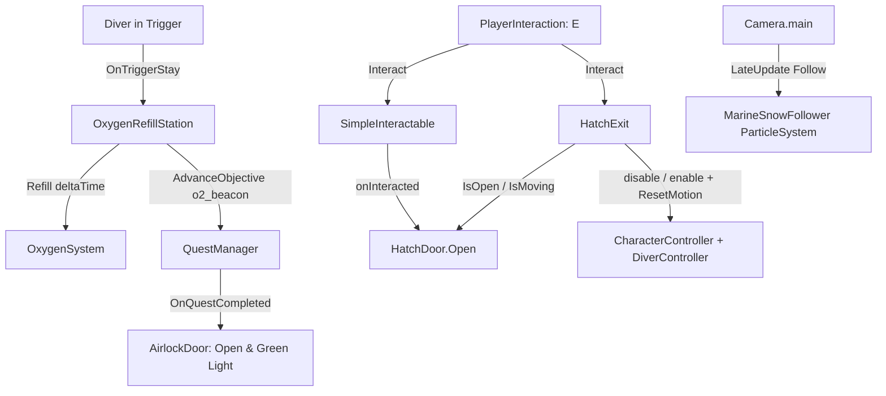

# Environment Systems
Ultima verifica: 2026-10-04

## Scopo e confini
Raggruppa gli elementi interattivi e atmosferici dell'ambiente di gioco non appartenenti alla fauna autonoma:
- Il portale stagno della base (`AirlockDoor`), che funge da passaggio di fine sezione legato agli obiettivi di missione.
- Il portello della capsula di discesa (`HatchDoor`), prima interazione del gioco: ruota sulla cerniera quando il diver preme [E].
- L'uscita guidata dalla capsula (`HatchExit`): a portello aperto, [E] porta il diver attraverso l'apertura fino al fondale a controlli bloccati.
- La stazione di rifornimento ossigeno (`OxygenRefillStation`), che ripristina la bombola del diver e avanza gli obiettivi di sopravvivenza.
- L'effetto atmosferico particellare della neve marina (`MarineSnowFollower`), ottimizzato per seguire il punto di vista del giocatore.
- Le isole di luce protetta (`StressLightZone`), documentate in dettaglio in [DarknessStress-docs.md](file:///Z:/_PROJECTS/Unity/Project_Deep/documentation/DarknessStress-docs.md).

## File e componenti
- `Assets/_Project/Code/Environment/AirlockDoor.cs`: Controller dell'apertura meccanica e dei segnali visivi del portale stagno della base DR-04.
- `Assets/_Project/Code/Environment/HatchDoor.cs`: Apertura a rotazione su un asse di un portello incernierato, con curva di easing ed eventi di inizio/fine.
- `Assets/_Project/Code/Environment/HatchExit.cs`: `IInteractable` che, a portello aperto, sposta il diver lungo una curva interno → apertura → fondale e poi restituisce i controlli.
- `Assets/_Project/Code/Environment/OxygenRefillStation.cs`: Ricaricatore continuo di O₂ per il diver in sosta sul trigger.
- `Assets/_Project/Code/Environment/MarineSnowFollower.cs`: Script ad esecuzione immediata (`ExecuteAlways`) che ancora il sistema particellare della neve marina davanti alla camera.
- `Assets/_Project/Code/Environment/StressLightZone.cs`: Trigger volumetrico di sollievo dallo stress (vedere [DarknessStress-docs.md](file:///Z:/_PROJECTS/Unity/Project_Deep/documentation/DarknessStress-docs.md)).

## Dipendenze e flusso dati
- **Progressione**: `AirlockDoor` si iscrive a `QuestManager.Instance.OnQuestCompleted` in `Start()`. All'apertura del portale si sposta verso `targetPosition`.
- **Portello capsula**: `HatchDoor` non legge input. Lo attiva un `SimpleInteractable` sullo stesso oggetto, il cui `onInteracted` chiama `HatchDoor.Open()` (vedi [Interaction.md](file:///Z:/_PROJECTS/Unity/Project_Deep/documentation/Interaction.md)).
- **Uscita capsula**: `HatchExit` è un `IInteractable` raggiunto da `PlayerInteraction`. Legge `HatchDoor.IsOpen`/`IsMoving`; durante l'uscita disabilita `CharacterController` e `DiverController` del giocatore e scrive direttamente `transform.position`, poi li riabilita e chiama `DiverController.ResetMotion()`.
- **Ricarica O₂**: `OxygenRefillStation` rileva l'`OxygenSystem` sul diver e chiama `Refill(Time.deltaTime)` durante la permanenza nel trigger.
- **Rendering & Atmosfera**: `MarineSnowFollower` calcola in `LateUpdate()` la posizione delle particelle oceaniche in base alla posizione e rotazione della `Camera.main`.

## Componenti

### AirlockDoor
- **Responsabilità e ciclo di vita**:
  - `Awake()`: Salva `closedPosition = doorPanel.localPosition` e imposta la luce `doorStatusLight` su `lockedColor`.
  - `Start()` / `OnDestroy()`: Sottoscrive e disdice `QuestManager.Instance.OnQuestCompleted`. Se la quest è già completata all'avvio, apre immediatamente la porta.
  - `Update()`: Quando `isOpen` è vero, interpola `doorPanel.localPosition` verso `targetPosition` a velocità `openSpeed`.
- **Campi Inspector**:
  - `Light doorStatusLight`: Faretto di segnalazione sopra la porta.
  - `Transform doorPanel`: Paratia mobile della porta.
  - `Vector3 openOffset` (default: `(0f, 3.5f, 0f)`): Spostamento relativo del pannello all'apertura.
  - `float openSpeed` (default: `2f` m/s).
  - `Color lockedColor` (default: Rosso), `Color unlockedColor` (default: Verde).
  - `bool isOpen` (debug sola lettura).
- **API pubbliche**:
  - `void HandleQuestCompleted()`: Avvia l'apertura della paratia e colora la luce di verde.

### HatchDoor
- **Responsabilità e ciclo di vita**:
  - `Awake()`: Se `doorPivot` è nullo usa il proprio `transform`; salva `closedRotation = doorPivot.localRotation`.
  - `Update()`: Solo durante l'apertura. Avanza il tempo, valuta `openCurve` e imposta `doorPivot.localRotation = closedRotation * AngleAxis(curve(t) * openAngle, hingeAxis)`. A fine corsa invoca `onOpened`.
  - Apertura one-shot: non esiste chiusura.
- **Campi Inspector**:
  - `Transform doorPivot` (default: `null` → se stesso): Transform ruotato. Il pivot deve stare sull'asse della cerniera.
  - `Vector3 hingeAxis` (default: `Vector3.right`): Asse di rotazione nello spazio locale del pivot.
  - `float openAngle` (default: `110f` gradi): Angolo di apertura. Il segno decide il verso.
  - `float openDuration` (default: `1.6f` secondi).
  - `AnimationCurve openCurve` (default: `EaseInOut(0,0,1,1)`).
  - `UnityEvent onOpenStarted`, `UnityEvent onOpened`: Agganci per audio, VFX e Timeline.
  - `bool isOpen` (debug sola lettura).
- **API pubbliche**:
  - `bool IsOpen { get; }`
  - `bool IsMoving { get; }`
  - `void Open()`: Avvia l'apertura e invoca `onOpenStarted`. Ignorata se il portello è già aperto.
- **Riferimenti obbligatori**: nessuno. Senza un `SimpleInteractable` (o altro chiamante di `Open()`) il portello resta chiuso.

### HatchExit
- **Responsabilità e ciclo di vita**:
  - Implementa `IInteractable`. Richiede un `Collider` (in scena un `BoxCollider` trigger sull'apertura).
  - `CanInteract(user)`: vero solo una volta, se `hatch.IsOpen && !hatch.IsMoving` e `passPoint`/`exitPoint` sono assegnati.
  - `Interact(user)`: memorizza il transform dell'utente, disabilita il suo `DiverController` e il suo `CharacterController`, invoca `onExitStarted`.
  - `Update()`: durante l'uscita sposta i piedi del diver su una Bézier quadratica da posizione iniziale a `exitPoint`, con controllo calcolato perché a metà corsa i piedi passino per `passPoint - up * eyeHeight` (la camera passa al centro dell'apertura). Interpolazione `SmoothStep`. A fine corsa riabilita i componenti, chiama `ResetMotion()` e invoca `onExited`.
  - La rotazione del diver non viene toccata.
- **Campi Inspector**:
  - `HatchDoor hatch` (default: `null`): Portello da cui dipende la disponibilità.
  - `Transform passPoint` (default: `null`): Punto attraversato dalla camera, al centro dell'apertura.
  - `Transform exitPoint` (default: `null`): Posizione dei piedi a fine uscita, sul fondale.
  - `float eyeHeight` (default: `1.375f`): Altezza occhi rispetto ai piedi; deve corrispondere a `DiverController` / `PlayerCameraRoot`.
  - `float duration` (default: `2.2f` secondi).
  - `string promptText` (default: `"Esci"`).
  - `UnityEvent onExitStarted`, `UnityEvent onExited`.
- **API pubbliche**: `string PromptText { get; }`, `bool CanInteract(GameObject user)`, `void Interact(GameObject user)`.
- **Riferimenti obbligatori**: `hatch`, `passPoint`, `exitPoint`. Se uno manca, `CanInteract` restituisce `false` e l'uscita non parte. L'utente deve avere `CharacterController` e `DiverController` (se mancano, vengono ignorati).

### OxygenRefillStation
- **Responsabilità e ciclo di vita**:
  - Richiede un `Collider` con `isTrigger = true`.
  - `OnTriggerEnter(Collider other)`: Cerca `OxygenSystem`, notifica l'obiettivo `"o2_beacon"` a `QuestManager.Instance` se non ancora inviato, e cambia la luce del beacon in `activeColor`.
  - `OnTriggerStay(Collider other)`: Chiama `playerOxygen.Refill(Time.deltaTime)`.
  - `OnTriggerExit(Collider other)`: Ripristina la luce in `standbyColor` e azzera il riferimento al player.
- **Campi Inspector**:
  - `float refillRatePerSecond` (default: `10f`): Parametro locale (nota: la velocità effettiva di ricarica è determinata da `OxygenProfile.refillRatePerSecond`).
  - `string questObjectiveId` (default: `"o2_beacon"`).
  - `Light stationBeaconLight`: Faro di segnalazione della colonnina.
  - `Color standbyColor` (default: ambra/giallo), `Color activeColor` (default: ciano/verde).

### MarineSnowFollower
- **Responsabilità e ciclo di vita**:
  - `[ExecuteAlways]` per visualizzare il pulviscolo marino sia in Play Mode che nell'Editor.
  - `LateUpdate()`: Posiziona il Transform del sistema particellare a `target.position + target.rotation * offset`.
- **Campi Inspector**:
  - `Transform target`: Camera da seguire (se nullo, individua `Camera.main`).
  - `Vector3 offset` (default: `(0f, 1f, 3f)`): Offset locale davanti agli occhi del diver.

## Setup in Unity
1. **Airlock**:
   - Creare un GameObject con la paratia mobile `doorPanel` e una luce `doorStatusLight`.
   - Aggiungere `AirlockDoor` e verificare che sia presente `QuestManager` in scena.
2. **Stazione O₂**:
   - Creare la mesh della colonnina, aggiungere un `Collider` impostato come trigger e il componente `OxygenRefillStation`.
3. **Portello capsula**:
   - Sulla mesh del portello (pivot sulla cerniera) aggiungere `HatchDoor` e `SimpleInteractable`; collegare `onInteracted` a `HatchDoor.Open`.
   - Il diver interagisce dall'interno: i `MeshCollider` non convessi non vengono colpiti dal lato posteriore, quindi aggiungere un figlio con `BoxCollider` trigger sottile davanti alla faccia interna. `PlayerInteraction` usa `QueryTriggerInteraction.Collide` e `GetComponentInParent`, quindi il trigger figlio basta.
   - Uscita: figlio della radice della capsula (non del portello, che ruota) con `BoxCollider` trigger appena oltre la faccia esterna del portello chiuso e `HatchExit`. Da portello chiuso il raggio colpisce prima il volume del portello; aperto, colpisce il volume d'uscita. Figli `HatchPassPoint` (centro apertura) e `HatchExitPoint` (fondale, con spazio libero per la capsula del player).
4. **Marine Snow**:
   - Creare un Particle System con particelle fluttuanti a bassa velocità e assegnare `MarineSnowFollower`.

## Configurazione verificata in prefab e scene
- Nella scena `Prototype.unity`:
  - `AirlockDoor` sigilla l'ingresso della stazione DR-04 fino al completamento dei tre compiti (generatore, O₂, comunicazioni).
  - La stazione di ricarica è collocata a metà percorso tra la capsula schiantata e la base.
- Nella scena `Assets/_Project/Prototype/GameplayLoop_Blockout.unity` (verificato 2026-10-04):
  - `UnderwaterLander_Crashed` è l'istanza diretta di `Assets/_Project/Models/Blends/UnderwaterLander_Crashed.blend`.
  - `UnderwaterLander_Crashed/MSH_Hatch_Door` ha `MeshCollider`, `HatchDoor` (valori di default: asse locale X, `+110°`, `1.6 s`) e `SimpleInteractable` con `promptText = "Apri portello"`, listener persistente `onInteracted → HatchDoor.Open`.
  - Figlio `HatchInteractVolume`: `BoxCollider` trigger, center `(0, 0.08, -0.79)`, size `(1.53, 0.04, 1.29)` nello spazio locale del portello.
  - `UnderwaterLander_Crashed/HatchExitVolume`: `BoxCollider` trigger (stessa posa del portello chiuso, center `(0, 0.41, -0.79)` circa, spessore `0.08`), `HatchExit` con valori di default collegato a `HatchDoor`; figli `HatchPassPoint` ≈ `(-4.09, 1.57, -4.61)` e `HatchExitPoint` ≈ `(-4.18, 0.46, -6.41)` su `Cliff`.
  - Verificato in Play Mode (2026-10-04, chiamando `Interact()` da codice, non con tastiera): portello chiuso → prompt "Apri portello"; aperto → prompt "Esci"; uscita completa con piedi a `HatchExitPoint`, `CharacterController` e `DiverController` riabilitati, camminata libera di 1 m in avanti e di lato. Lungo il percorso nessun collider entro 20 cm dalla testa.
  - Verificato in editor: dalla posizione iniziale del player il raggio dal centro camera colpisce `HatchInteractVolume` con prompt "Apri portello". In Play Mode `Interact()` apre il portello; la posa finale (`+110°` su X) va verso l'esterno e l'alto senza sovrapposizioni con altri collider. Non verificato con input reale da tastiera.

## Limiti e problemi noti
- `HatchDoor`: nessuna chiusura né stato salvato. Gli override del componente vivono sull'istanza del `.blend` in scena: rinominare `MSH_Hatch_Door` in Blender li fa perdere.
- Il `CharacterController` del player (altezza 2 m, raggio 0,5) non può muoversi dentro la capsula: l'interno è una sfera di 2 m e il pavimento `MSH_PV_BaseRing` è una conca. Il player parte inoltre compenetrato nel pavimento (piedi a y 0,31, superficie a 0,84) e viene spinto su al primo `Move`. Per questo l'uscita è guidata (`HatchExit`) e non a piedi.
- `HatchExit` disabilita `DiverController` per intero: durante l'uscita (2,2 s) anche la rotazione della visuale è ferma.
- In Play Mode all'avvio la camera del player scende (y ≈ 0.96 contro 1.69 in editor) e il raggio colpisce `MSH_PV_BaseRing`: per vedere il prompt il giocatore deve alzare lo sguardo verso il portello.

## Sistemi collegati
- [Interaction.md](file:///Z:/_PROJECTS/Unity/Project_Deep/documentation/Interaction.md)
- [Oxygen.md](file:///Z:/_PROJECTS/Unity/Project_Deep/documentation/Oxygen.md)
- [Quests.md](file:///Z:/_PROJECTS/Unity/Project_Deep/documentation/Quests.md)
- [DarknessStress-docs.md](file:///Z:/_PROJECTS/Unity/Project_Deep/documentation/DarknessStress-docs.md)
