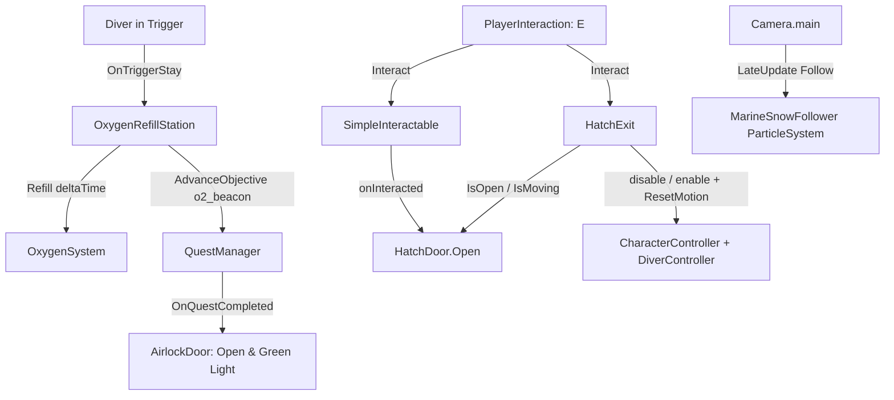

# Environment Systems
Ultima verifica: 2026-10-09

## Scopo e confini
Raggruppa gli elementi interattivi e atmosferici dell'ambiente di gioco non appartenenti alla fauna autonoma:
- Il portale stagno della base (`AirlockDoor`), che funge da passaggio di fine sezione legato agli obiettivi di missione.
- Il portello della capsula di discesa (`HatchDoor`), prima interazione del gioco: ruota sulla cerniera quando il diver preme [E].
- L'uscita guidata dalla capsula (`HatchExit`): a portello aperto, [E] porta il diver attraverso l'apertura fino al fondale a controlli bloccati.
- La stazione di rifornimento ossigeno (`OxygenRefillStation`), che ripristina la bombola del diver e avanza gli obiettivi di sopravvivenza.
- L'effetto atmosferico particellare della neve marina (`MarineSnowFollower`), ottimizzato per seguire il punto di vista del giocatore.
- Le isole di luce protetta (`StressLightZone`), documentate in dettaglio in [DarknessStress-docs.md](file:///Z:/_PROJECTS/Unity/Project_Deep/documentation/DarknessStress-docs.md).

## File e componenti
- `Assets/_Project/Code/Environment/AirlockDoor.cs`: Controller dell'apertura meccanica e dei segnali visivi del portale stagno della base DR-04.
- `Assets/_Project/Code/Environment/HatchDoor.cs`: Apertura a rotazione su un asse di un portello incernierato, con curva di easing ed eventi di inizio/fine.
- `Assets/_Project/Code/Environment/HatchExit.cs`: `IInteractable` che, a portello aperto, sposta il diver lungo una curva interno → apertura → fondale e poi restituisce i controlli.
- `Assets/_Project/Code/Environment/OxygenRefillStation.cs`: Ricaricatore continuo di O₂ per il diver in sosta sul trigger.
- `Assets/_Project/Code/Environment/MarineSnowFollower.cs`: Script ad esecuzione immediata (`ExecuteAlways`) che ancora il sistema particellare della neve marina davanti alla camera.
- `Assets/_Project/Code/Environment/StressLightZone.cs`: Trigger volumetrico di sollievo dallo stress (vedere [DarknessStress-docs.md](file:///Z:/_PROJECTS/Unity/Project_Deep/documentation/DarknessStress-docs.md)).

## Dipendenze e flusso dati
- **Progressione**: `AirlockDoor` si iscrive a `QuestManager.Instance.OnQuestCompleted` in `Start()`. All'apertura del portale si sposta verso `targetPosition`.
- **Portello capsula**: `HatchDoor` non legge input. Lo attiva un `SimpleInteractable` sullo stesso oggetto, il cui `onInteracted` chiama `HatchDoor.Open()` (vedi [Interaction.md](file:///Z:/_PROJECTS/Unity/Project_Deep/documentation/Interaction.md)).
- **Uscita capsula**: `HatchExit` è un `IInteractable` raggiunto da `PlayerInteraction`. Legge `HatchDoor.IsOpen`/`IsMoving`; durante l'uscita disabilita `CharacterController` e `DiverController` del giocatore, scrive direttamente posizione e yaw del diver e posa di `DiverController.CameraTarget`, poi li riabilita, azzera `ViewRoll`, sblocca `LockMovement` e chiama `SetViewPitch(0)` e `ResetMotion()`.
- **Ricarica O₂**: `OxygenRefillStation` rileva l'`OxygenSystem` sul diver e chiama `Refill(Time.deltaTime)` durante la permanenza nel trigger.
- **Rendering & Atmosfera**: `MarineSnowFollower` calcola in `LateUpdate()` la posizione delle particelle oceaniche in base alla posizione e rotazione della `Camera.main`.

## Componenti

### AirlockDoor
- **Responsabilità e ciclo di vita**:
  - `Awake()`: Salva `closedPosition = doorPanel.localPosition` e imposta la luce `doorStatusLight` su `lockedColor`.
  - `Start()` / `OnDestroy()`: Sottoscrive e disdice `QuestManager.Instance.OnQuestCompleted`. Se la quest è già completata all'avvio, apre immediatamente la porta.
  - `Update()`: Quando `isOpen` è vero, interpola `doorPanel.localPosition` verso `targetPosition` a velocità `openSpeed`.
- **Campi Inspector**:
  - `Light doorStatusLight`: Faretto di segnalazione sopra la porta.
  - `Transform doorPanel`: Paratia mobile della porta.
  - `Vector3 openOffset` (default: `(0f, 3.5f, 0f)`): Spostamento relativo del pannello all'apertura.
  - `float openSpeed` (default: `2f` m/s).
  - `Color lockedColor` (default: Rosso), `Color unlockedColor` (default: Verde).
  - `bool isOpen` (debug sola lettura).
- **API pubbliche**:
  - `void HandleQuestCompleted()`: Avvia l'apertura della paratia e colora la luce di verde.

### HatchDoor
- **Responsabilità e ciclo di vita**:
  - `Awake()`: Se `doorPivot` è nullo usa il proprio `transform`; salva `closedRotation = doorPivot.localRotation`.
  - `Update()`: Solo durante l'apertura. Avanza il tempo, valuta `openCurve` e imposta `doorPivot.localRotation = closedRotation * AngleAxis(curve(t) * openAngle, hingeAxis)`. A fine corsa invoca `onOpened`.
  - Apertura one-shot: non esiste chiusura.
- **Campi Inspector**:
  - `Transform doorPivot` (default: `null` → se stesso): Transform ruotato. Il pivot deve stare sull'asse della cerniera.
  - `Vector3 hingeAxis` (default: `Vector3.right`): Asse di rotazione nello spazio locale del pivot.
  - `float openAngle` (default: `110f` gradi): Angolo di apertura. Il segno decide il verso.
  - `float openDuration` (default: `1.6f` secondi).
  - `AnimationCurve openCurve` (default: `EaseInOut(0,0,1,1)`).
  - `UnityEvent onOpenStarted`, `UnityEvent onOpened`: Agganci per audio, VFX e Timeline.
  - `bool isOpen` (debug sola lettura).
- **API pubbliche**:
  - `bool IsOpen { get; }`
  - `bool IsMoving { get; }`
  - `void Open()`: Avvia l'apertura e invoca `onOpenStarted`. Ignorata se il portello è già aperto.
- **Riferimenti obbligatori**: nessuno. Senza un `SimpleInteractable` (o altro chiamante di `Open()`) il portello resta chiuso.

### HatchExit
- **Responsabilità e ciclo di vita**:
  - Implementa `IInteractable`. Richiede un `Collider` (in scena un `BoxCollider` trigger sull'apertura). L'uscita è un salto scriptato in tre fasi, non un verbo del giocatore (il salto libero resta all'Hydropack, vedi [PlayerMovement.md](file:///Z:/_PROJECTS/Unity/Project_Deep/documentation/PlayerMovement.md)).
  - `CanInteract(user)`: vero solo una volta, se `hatch.IsOpen && !hatch.IsMoving` e `passPoint`/`exitPoint` sono assegnati.
  - `Interact(user)`: memorizza il transform dell'utente, legge `DiverController.CameraTarget`, disabilita `DiverController` e `CharacterController`. Calcola il punto di atterraggio: con `snapExitToGround` un raycast da 1 m sopra `exitPoint` verso il basso (5 m, `groundMask`, trigger ignorati) trova il suolo, e la quota viene alzata di `height / 2 - center.y + skinWidth` del `CharacterController`, cioè dove il controller lascerebbe il pivot; senza colpo resta `exitPoint`. Salva yaw, pitch, `DiverController.ViewRoll` e posizione della camera di partenza, poi invoca `onExitStarted`.
  - `Update()`, in tre fasi:
    1. **Raccolta** (`crouchDuration`): il diver resta fermo, ruota metà dello yaw verso l'uscita, la testa scende di `crouchDepth` e lo sguardo va verso `passPoint` più `crouchPitch`.
    2. **Salto** (`jumpDuration`): i piedi seguono una Bézier quadratica da partenza ad atterraggio, con controllo calcolato perché a metà curva passino per `passPoint - up * eyeHeight`. Oltre metà si aggiunge una parabola `arcHeight * sin(π·u)`, dopo il portello per non toccarne il bordo. L'avanzamento nel tempo segue `jumpCurve` (veloce alla spinta, frenato verso la fine come dall'acqua). Lo sguardo insegue l'inclinazione della traiettoria (`pathLookWeight`, limitata a −30°…35°), lo yaw arriva alla direzione d'uscita, il roll oscilla fino a `flightRoll` a metà volo e la testa torna in quota nel primo quarto.
    3. **Atterraggio** (`landDuration`): piedi fermi sul punto di atterraggio, la testa scende di `landDepth` e risale (discesa rapida, risalita lenta), lo sguardo ha uno scatto di `landPitchKick` e si assesta a 0.
  - Raddrizzamento dal sedile: roll di partenza (`ViewRoll`) e posizione laterale della camera tornano a 0 e all'altezza occhi standard entro la raccolta più il 40% del salto, cioè quando il diver ha passato il portello.
  - Fine: posa finale, `CharacterController` riattivato, su `DiverController` `ViewRoll = 0`, `CameraBasePosition = (0, eyeHeight, 0)`, `enabled = true`, `SetViewPitch(0)`, `ResetMotion()`, `LockMovement = false`; poi `onExited`.
- **Campi Inspector**:
  - `HatchDoor hatch` (default: `null`): Portello da cui dipende la disponibilità.
  - `Transform passPoint` (default: `null`): Punto attraversato dalla camera, al centro dell'apertura.
  - `Transform exitPoint` (default: `null`): Punto di uscita sul fondale (vedi `snapExitToGround`).
  - `float eyeHeight` (default: `1.375f`): Altezza occhi rispetto ai piedi; deve corrispondere a `DiverController` / `PlayerCameraRoot`.
  - `string promptText` (default: `"Esci"`).
  - `bool snapExitToGround` (default: `true`), `LayerMask groundMask` (default: `~0`): Atterraggio sul suolo sotto `exitPoint`.
  - Raccolta: `float crouchDuration` (`0.45`), `float crouchDepth` (`0.15` m), `float crouchPitch` (`10`°).
  - Salto: `float jumpDuration` (`1.4`), `AnimationCurve jumpCurve` (default: da (0,0) con tangente 2.4 a (1,1) con tangente 0.2 in ingresso e 0 in uscita), `float arcHeight` (`0.35` m), `float pathLookWeight` (`0.6`, 0–1), `float flightRoll` (`3`°).
  - Atterraggio: `float landDuration` (`0.6`), `float landDepth` (`0.2` m), `float landPitchKick` (`6`°).
  - `UnityEvent onExitStarted`, `UnityEvent onExited`.
- **API pubbliche**: `string PromptText { get; }`, `bool CanInteract(GameObject user)`, `void Interact(GameObject user)`.
- **Riferimenti obbligatori**: `hatch`, `passPoint`, `exitPoint`. Se uno manca, `CanInteract` restituisce `false` e l'uscita non parte. L'utente deve avere `CharacterController` e `DiverController` (se mancano, vengono ignorati; senza `DiverController` la camera non viene animata).

### OxygenRefillStation
- **Responsabilità e ciclo di vita**:
  - Richiede un `Collider` con `isTrigger = true`.
  - `OnTriggerEnter(Collider other)`: Cerca `OxygenSystem`, notifica l'obiettivo `"o2_beacon"` a `QuestManager.Instance` se non ancora inviato, e cambia la luce del beacon in `activeColor`.
  - `OnTriggerStay(Collider other)`: Chiama `playerOxygen.Refill(Time.deltaTime)`.
  - `OnTriggerExit(Collider other)`: Ripristina la luce in `standbyColor` e azzera il riferimento al player.
- **Campi Inspector**:
  - `float refillRatePerSecond` (default: `10f`): Parametro locale (nota: la velocità effettiva di ricarica è determinata da `OxygenProfile.refillRatePerSecond`).
  - `string questObjectiveId` (default: `"o2_beacon"`).
  - `Light stationBeaconLight`: Faro di segnalazione della colonnina.
  - `Color standbyColor` (default: ambra/giallo), `Color activeColor` (default: ciano/verde).

### MarineSnowFollower
- **Responsabilità e ciclo di vita**:
  - `[ExecuteAlways]` per visualizzare il pulviscolo marino sia in Play Mode che nell'Editor.
  - `LateUpdate()`: Posiziona il Transform del sistema particellare a `target.position + target.rotation * offset`.
- **Campi Inspector**:
  - `Transform target`: Camera da seguire (se nullo, individua `Camera.main`).
  - `Vector3 offset` (default: `(0f, 1f, 3f)`): Offset locale davanti agli occhi del diver.
- **Aspetto delle particelle (verificato 2026-10-07 in `SCN_EnvDemo`, oggetto `MarineSnowParticles`)**:
  - Materiale `Assets/_Project/Materials/Environment/VFX/M_MarineSnow.mat`: shader `Universal Render Pipeline/Particles/Unlit`, superficie trasparente con blend additivo, tinta `(0.85, 0.92, 1, 0.8)`.
  - Texture `T_MarineSnow_Atlas.png` (512×512, atlas 4×4, bianco con la forma nell'alpha): riga 1 fiocchi soffici, riga 2 aggregati a grappolo, riga 3 filamenti, riga 4 granelli con alone. Generata proceduralmente.
  - Particle System: `Texture Sheet Animation` in modalità Grid 4×4, `WholeSheet`, frame iniziale casuale; rotazione iniziale casuale 0–360° e `Rotation over Lifetime` tra −0.3 e 0.3 rad/s; `startSize` da 0.02 a 0.09 m; `maxParticles` 600.

## Setup in Unity
1. **Airlock**:
   - Creare un GameObject con la paratia mobile `doorPanel` e una luce `doorStatusLight`.
   - Aggiungere `AirlockDoor` e verificare che sia presente `QuestManager` in scena.
2. **Stazione O₂**:
   - Creare la mesh della colonnina, aggiungere un `Collider` impostato come trigger e il componente `OxygenRefillStation`.
3. **Portello capsula**:
   - Sulla mesh del portello (pivot sulla cerniera) aggiungere `HatchDoor` e `SimpleInteractable`; collegare `onInteracted` a `HatchDoor.Open`.
   - Il diver interagisce dall'interno: i `MeshCollider` non convessi non vengono colpiti dal lato posteriore, quindi aggiungere un figlio con `BoxCollider` trigger sottile davanti alla faccia interna. `PlayerInteraction` usa `QueryTriggerInteraction.Collide` e `GetComponentInParent`, quindi il trigger figlio basta.
   - Uscita: figlio della radice della capsula (non del portello, che ruota) con `BoxCollider` trigger appena oltre la faccia esterna del portello chiuso e `HatchExit`. Da portello chiuso il raggio colpisce prima il volume del portello; aperto, colpisce il volume d'uscita. Figli `HatchPassPoint` (centro apertura) e `HatchExitPoint` (fondale, con spazio libero per la capsula del player).
4. **Marine Snow**:
   - Creare un Particle System con particelle fluttuanti a bassa velocità e assegnare `MarineSnowFollower`.
   - Per l'aspetto a fiocchi: materiale `M_MarineSnow` sul `ParticleSystemRenderer` e `Texture Sheet Animation` 4×4 (vedi sopra).

## Configurazione verificata in prefab e scene
- Nella scena `Prototype.unity` (rimossa il 2026-10-07 nel commit `f0fb87b`, recuperabile dalla storia di Git; configurazione non riverificata dopo la rimozione):
  - `AirlockDoor` sigilla l'ingresso della stazione DR-04 fino al completamento dei tre compiti (generatore, O₂, comunicazioni).
  - La stazione di ricarica è collocata a metà percorso tra la capsula schiantata e la base.
- Nella scena `Assets/_Project/Scenes/SCN_Gameplay.unity` (verificato 2026-10-04):
  - `UnderwaterLander_Crashed` è l'istanza diretta di `Assets/_Project/Models/Blends/UnderwaterLander_Crashed.blend`.
  - `UnderwaterLander_Crashed/MSH_Hatch_Door` ha `MeshCollider`, `HatchDoor` (valori di default: asse locale X, `+110°`, `1.6 s`) e `SimpleInteractable` con `promptText = "Apri portello"`, listener persistente `onInteracted → HatchDoor.Open`.
  - Figlio `HatchInteractVolume`: `BoxCollider` trigger, center `(0, 0.08, -0.79)`, size `(1.53, 0.04, 1.29)` nello spazio locale del portello.
  - `UnderwaterLander_Crashed/HatchExitVolume`: `BoxCollider` trigger (stessa posa del portello chiuso, center `(0, 0.41, -0.79)` circa, spessore `0.08`), `HatchExit` con valori di default collegato a `HatchDoor`; figli `HatchPassPoint` ≈ `(-4.09, 1.57, -4.61)` e `HatchExitPoint` ≈ `(-4.18, 0.46, -6.41)` su `Cliff`.
  - Verificato in Play Mode (2026-10-04, chiamando `Interact()` da codice, non con tastiera): portello chiuso → prompt "Apri portello"; aperto → prompt "Esci"; uscita completa con piedi a `HatchExitPoint`, `CharacterController` e `DiverController` riabilitati, camminata libera di 1 m in avanti e di lato. Lungo il percorso nessun collider entro 20 cm dalla testa.
  - Verificato in editor: dalla posizione iniziale del player il raggio dal centro camera colpisce `HatchInteractVolume` con prompt "Apri portello". In Play Mode `Interact()` apre il portello; la posa finale (`+110°` su X) va verso l'esterno e l'alto senza sovrapposizioni con altri collider.
  - Verificato da Manu in Play Mode con input reale (2026-10-04): [E] apre il portello e [E] su "Esci" porta il diver fuori dalla capsula.
  - Al 2026-10-09 il player parte seduto sul sedile (vedi `PlayerWakeUpSequence` in [Prologue.md](file:///Z:/_PROJECTS/Unity/Project_Deep/documentation/Prologue.md)), piedi a `(-4.08, 0.26, -2.75)`. `HatchExitPoint` è a `(-4.62, 0.93, -6.06)`, circa 0.5 m sopra il `Cliff`: il raycast di `snapExitToGround` porta l'atterraggio a y 0.464.
  - Verificato in Play Mode il 2026-10-09 (Unity 6000.3.19f1, `Interact()` chiamato da codice, non con tastiera): da seduto il raggio di `PlayerInteraction` colpisce `SimpleInteractable` del portello e poi, ad apertura finita, `HatchExit`. Uscita completa in 2.45 s: raccolta, spinta attraverso l'apertura, parabola (picco piedi y 0.61), atterraggio a y 0.464. Il roll del sedile scende da 16.8° a 0 prima del passaggio dal portello. Fine con `LockMovement` falso, `grounded` vero, `ViewRoll` 0, posizione invariata un secondo dopo (nessun assestamento del `CharacterController`).

## Limiti e problemi noti
- `HatchDoor`: nessuna chiusura né stato salvato. Gli override del componente vivono sull'istanza del `.blend` in scena: rinominare `MSH_Hatch_Door` in Blender li fa perdere.
- Il `CharacterController` del player (altezza 2 m, raggio 0,5) non può muoversi dentro la capsula: l'interno è una sfera di 2 m e il pavimento `MSH_PV_BaseRing` è una conca. Per questo il diver resta seduto con il controller spento (`PlayerWakeUpSequence`) e l'uscita è guidata (`HatchExit`), non a piedi.
- `HatchExit` disabilita `DiverController` per intero: durante l'uscita (2,45 s) il giocatore non controlla la visuale.
- Il moto dell'uscita non controlla le collisioni: il percorso è valido per la posa attuale di capsula, `HatchPassPoint` e `HatchExitPoint`. Spostandoli va ricontrollato che la testa non attraversi il bordo dell'apertura.
- Senza suolo entro 4 m sotto `exitPoint` l'atterraggio usa la quota del punto e il diver cade per gravità alla riattivazione del controller.

## Sistemi collegati
- [EnvironmentShading.md](file:///Z:/_PROJECTS/Unity/Project_Deep/documentation/EnvironmentShading.md): shader del fondale e delle rocce e fusione tra mesh.
- [Rendering.md](file:///Z:/_PROJECTS/Unity/Project_Deep/documentation/Rendering.md): post-processing e finish analogico.
- [Interaction.md](file:///Z:/_PROJECTS/Unity/Project_Deep/documentation/Interaction.md)
- [Oxygen.md](file:///Z:/_PROJECTS/Unity/Project_Deep/documentation/Oxygen.md)
- [Quests.md](file:///Z:/_PROJECTS/Unity/Project_Deep/documentation/Quests.md)
- [DarknessStress-docs.md](file:///Z:/_PROJECTS/Unity/Project_Deep/documentation/DarknessStress-docs.md)
