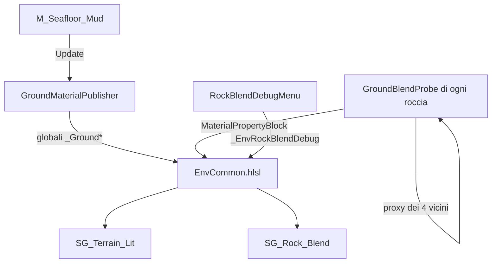

# Environment Shading — fondale, rocce e fusione tra mesh
Ultima verifica: 2026-10-09

## Scopo e confini
Fa sì che fondale e rocce condividano lo stesso fango e che rocce che si compenetrano si fondano senza bordo di luce, **senza modificare le mesh**: ogni roccia si può spostare e la fusione si ricalcola da sola.

Coperto qui: i due Shader Graph dell'ambiente, il codice HLSL condiviso, i due componenti runtime che alimentano gli shader e lo strumento di debug nell'Editor.
Non coperto: il post-processing (vedi [Rendering.md](Rendering.md)), la neve marina (vedi [Environment.md](Environment.md)), il flusso asset in Blender e Painter (nel vault: `Ambiente-Abissale`, `Shader-Ambiente`).

Stato: **implementato e verificato** in `SCN_EnvDemo` con due istanze di `SM_MediumRock_low` (vedi Verifica). **Pianificato**: tarare `proxyShape = Box` su slope e scarpate, default dei parametri di fusione.

## File e componenti
- `Assets/_Project/Materials/Shaders/EnvCommon.hlsl`: codice condiviso (Custom Function di Shader Graph in modalità File): `TerrainSurface_float`, `RockSurface_float`, campionamento del fango, SDF dei proxy.
- `Assets/_Project/Materials/Shaders/SG_Terrain_Lit.shadergraph` (shader `Deeplonauts/SG_Terrain_Lit`): fondale con World UV, stochastic tiling e macro variation.
- `Assets/_Project/Materials/Shaders/SG_Rock_Blend.shadergraph` (shader `Deeplonauts/SG_Rock_Blend`): roccia con mappe di Painter su UV della mesh, fusa nel fango dalle maschere.
- `Assets/_Project/Code/Environment/GroundMaterialPublisher.cs`: pubblica il materiale del terreno come proprietà globali.
- `Assets/_Project/Code/Environment/GroundBlendProbe.cs`: per roccia, raycast sul suolo e proxy SDF propri e dei vicini.
- `Assets/_Project/Code/Editor/RockBlendDebugMenu.cs`: menu di debug che mostra le maschere come colori.
- Materiali: `Assets/_Project/Materials/Environment/` (`M_Terrain_Master`, `M_Rock_Master`, `Seafloor/M_Seafloor_Mud`, `Rocks/<asset>/M_Rock_*`).

## Dipendenze e flusso dati
1. `GroundMaterialPublisher` (su un renderer del terreno) legge in `Update()` il `sharedMaterial` e imposta le globali `_GroundBaseMap`, `_GroundBumpMap`, `_GroundMSMap`, `_GroundTint`, `_GroundUV`, `_GroundColorParams`, `_GroundSurfParams`, `_GroundMacro`.
2. `GroundBlendProbe` (su ogni roccia) scrive nel `MaterialPropertyBlock` del renderer: `_GroundPlanePoint`, `_GroundPlaneNormal`, `_RockProxyM[4]`, `_RockProxyR[4]`, `_RockNeighborParams`.
3. `RockSurface_float` combina quattro maschere e produce colore, normale, metallico, smoothness e occlusione.

**Maschere in `RockSurface_float`**
- *contatto*: distanza dal piano del suolo trovato dal raycast, bordo spezzato dal noise;
- *sedimento sopra*: facce rivolte verso l'alto in world space, indipendente dalla rotazione;
- *cavità*: l'AO del bake riempie le fessure;
- *giuntura*: distanza dal proxy SDF del vicino più vicino. Dentro la fascia la normale si piega verso quella condivisa (normale geometrica + gradiente del vicino) e si deposita fango.

La maschera finale è `saturate(max(contatto, giuntura * neighborSediment, sedimento sopra, cavità))`.

**Selezione dei vicini.** Una roccia raccoglie le altre `GroundBlendProbe` attive i cui bounds toccano i suoi, allargati di `neighborBlendWidth * 2`. Con più di 4 candidati tiene quelle con la sovrapposizione di volume maggiore. Il costo per pixel è fisso e non dipende dal numero di rocce in scena.

**Aggiornamento.** Una roccia che si sposta (`transform.hasChanged`) rifà il raycast e incrementa un contatore statico; ogni altra `GroundBlendProbe` che vede un contatore diverso rilegge i vicini nello stesso `Update()`.

## Componenti

### GroundMaterialPublisher
- Responsabilità: copia i parametri del materiale del terreno nelle globali degli shader, così la roccia campiona lo stesso fango con gli stessi parametri.
- Ciclo di vita: `[ExecuteAlways]`, `[RequireComponent(typeof(Renderer))]`. `OnEnable()` prende il renderer e pubblica; `Update()` ripubblica a ogni frame (anche in editor).
- Campi Inspector: nessuno.
- API pubbliche: nessuna.
- Riferimenti obbligatori: un `Renderer` con `sharedMaterial` basato su `SG_Terrain_Lit` che esponga `_BaseMap`, `_BumpMap`, `_MetallicGlossMap`, `_BaseColor`, `_Offset`, `_WorldTileSize`, `_StochasticTiling`, `_Brightness`, `_Saturation`, `_Contrast`, `_NormalStrength`, `_SmoothnessMin`, `_SmoothnessMax`, `_StochasticSharpness`, `_MacroStrength`, `_MacroScale`. Se il materiale è nullo non pubblica nulla; se manca una proprietà `GetFloat`/`GetTexture` solleva un errore.

### GroundBlendProbe
- Responsabilità: trova il suolo sotto la roccia, pubblica il proprio proxy SDF e legge quelli dei vicini.
- Ciclo di vita: `[ExecuteAlways]`, `[RequireComponent(typeof(Renderer))]`. `OnEnable()` si registra nella lista statica `Active`, incrementa il contatore e fa `Probe()`. `OnDisable()` si rimuove e azzera il property block. `Update()` rifà `Probe()` se il transform è cambiato, oppure `Apply()` se è cambiato solo il contatore. `OnValidate()` rifà `Probe()` in editor.
- Campi Inspector:

| Campo | Tipo | Default | Significato |
|---|---|---|---|
| `groundMask` | `LayerMask` | `~0` | Layer considerati fondale per il raycast |
| `probeStartAbove` | `float` | 2 | Quanto sopra la cima della roccia parte il raycast (m) |
| `probeDistance` | `float` | 50 | Lunghezza massima del raycast sotto la cima (m) |
| `proxyShape` | `ProxyShape` | `Ellipsoid` | Forma del proxy visto dalle vicine |
| `proxyScale` | `Vector3` | `(1,1,1)` | Scala del proxy rispetto ai bounds della mesh, per asse locale |
| `proxyOffset` | `Vector3` | `(0,0,0)` | Spostamento del centro, in coordinate locali |
| `boxRounding` | `float` 0–0.99 | 0.3 | Raggio di arrotondamento degli spigoli del box (m), limitato al semiasse più corto |
| `blendWithNeighbors` | `bool` | `true` | Se falso la roccia fa solo da ricevitore |
| `neighborBlendWidth` | `float` ≥ 0.01 | 0.5 | Larghezza della fascia di sfumatura (m) |
| `neighborNormalBlend` | `float` 0–1 | 0.8 | Quanto la normale si piega verso quella condivisa |
| `neighborSediment` | `float` 0–1 | 0.6 | Quanto fango nella giuntura |

- API pubbliche:
  - `public enum ProxyShape { Ellipsoid = 1, Box = 2 }`
  - `public const int MaxNeighbors = 4;`
  - `public void Probe()`: ricalcola piano del suolo e proxy dei vicini e aggiorna il renderer. Va richiamata se si cambia il terreno senza muovere la roccia.
- Riferimenti obbligatori: un `Renderer` (il proxy usa `MeshFilter.sharedMesh.bounds`, o `Renderer.localBounds` se manca) e almeno un collider sul suolo nel `groundMask`, altrimenti `_GroundPlaneNormal.w = 0` e la maschera di contatto resta spenta. Le rocce non hanno bisogno di collider.
- Formato dei proxy pubblicati: `_RockProxyM[i]` è la matrice mondo → proxy (solo rotazione e traslazione); `_RockProxyR[i]` ha i semiassi in `xyz` e in `w` la forma più l'arrotondamento (`1` ellissoide, `2 + r` box con spigoli di raggio `r`); `_RockNeighborParams` = larghezza, piega normale, sedimento, numero di vicini.

### RockBlendDebugMenu
- Responsabilità: mostra le maschere di `SG_Rock_Blend` come colori per tarare proxy e parametri. Rosso = contatto col suolo, verde = giuntura coi vicini, blu = sedimento sopra e cavità.
- Uso: menu `Deeplonauts/Debug/Rock Blend Masks` (con spunta). Imposta la globale `_EnvRockBlendDebug` a 1 o 0; non è salvata in scena e a ogni riavvio dell'Editor torna a 0.
- API pubbliche: nessuna (metodi privati `Toggle` e `ToggleValidate`). Compilata solo in Editor (`#if UNITY_EDITOR`).

## Setup in Unity
1. Sul renderer del terreno: `GroundMaterialPublisher`, con materiale basato su `SG_Terrain_Lit`.
2. Su ogni roccia: `GroundBlendProbe`, materiale basato su `SG_Rock_Blend`.
3. Sul terreno un collider che il `groundMask` includa.
4. Ogni roccia con il componente pubblica anche il proprio proxy: per far fondere due rocce serve il componente su **entrambe**.
5. Selezionando una roccia, il gizmo arancione mostra il suo proxy (ellissoide o box) e il gizmo azzurro il punto del suolo trovato. Regolare `proxyScale` e `proxyOffset` finché il proxy segue la forma.
6. Pareti e cliff: `proxyShape = Box`. Massi: `Ellipsoid`.

## Configurazione verificata in prefab e scene
`SCN_EnvDemo` (`Assets/_Project/Scenes/SCN_EnvDemo.unity`): due istanze di `SM_MediumRock_low` con `GroundBlendProbe` e materiale `M_Rock_MediumRock`. Sulla `(1)`: `neighborBlendWidth` 0.12, `neighborNormalBlend` 0.41, `neighborSediment` 0.56; sull'altra i default. Il terreno è sul layer `Seafloor`. Non verificata la configurazione di slope e scarpata pillow.

Layer `Seafloor` (10, in `ProjectSettings/TagManager.asset`): ci stanno solo i collider del fondale. I prefab `SM_LargeRock_low`, `SM_MediumRock_low`, `SM_SmallRock_low` e `SM_Slope_low` hanno `groundMask` = solo `Seafloor` (1024), così una roccia appoggiata su un'altra non la scambia per il suolo.

`SCN_Gameplay` (`Assets/_Project/Scenes/SCN_Gameplay.unity`), al 2026-10-09: `MapBlocking/Cliff` e `MapBlocking/Terrain` su layer `Seafloor` con `M_Seafloor_Mud`; `GroundMaterialPublisher` su `MapBlocking/Cliff`. Root vuota `ENV_M1` per le rocce dell'ambiente M1, che non sono ancora piazzate (nessun `GroundBlendProbe` in scena). La torre di blockout usa lo shader landmark (vedi [Landmark.md](Landmark.md)).

## Estensione del sistema
- Nuova forma di proxy: aggiungere un valore a `ProxyShape`, la sua SDF in `EnvCommon.hlsl` e il ramo in `EnvNearestRockProxy`. Il valore va codificato nella parte intera di `w` in `_RockProxyR`.
- Più di 4 vicini: cambiare `MaxNeighbors` e `ENV_MAX_ROCK_NEIGHBORS` insieme.
- Dopo ogni modifica a `EnvCommon.hlsl` forzare il reimport di `SG_Rock_Blend.shadergraph` (e di `SG_Terrain_Lit`): l'include della Custom Function non sempre ricompila da solo.

## Limiti e problemi noti
- **Silhouette e ombre non si cancellano.** Dove una roccia sta davanti a un'altra il bordo è un salto di profondità, e la giuntura riceve ombre e SSAO veri. La fusione agisce solo sulla linea di intersezione.
- Il proxy approssima la forma: su rocce molto irregolari la fascia può allargarsi o sparire in alcuni punti.
- L'uso di `MaterialPropertyBlock` rende le rocce incompatibili con l'SRP Batcher (accettato).
- Il numero di vicini è limitato a 4 per roccia.
- Scartati: intersection fade su depth e scene color (coda Transparent, niente SSAO e depth), normali scritte nei vertex stream (sfumatura limitata dalla densità della mesh), normali trasferite e cluster unici in Blender (distruttivi), dither con depth offset (fragile in URP).
- In Scene View, durante la compilazione asincrona degli shader le rocce compaiono ciano: attendere.

## Verifica
Eseguita il 2026-10-07 in Unity 6000.3.19f1 (URP 17.3.0):
- compilazione C# senza errori; `SG_Rock_Blend` senza messaggi dello shader;
- le due rocce risultano vicine l'una dell'altra (`_RockNeighborParams.w = 1`) e ricevono proxy e parametri;
- confronto di due render dalla stessa camera, fusione accesa contro spenta: cambia il 29% dei pixel; con sedimento 1 e larghezza 1.5 il fango copre le facce vicine alla giuntura;
- verifica visiva sulla linea di intersezione: il salto di luce sparisce;
- vista di debug: compila e mostra le tre maschere.

Non verificato: più di due rocce, `Box`, il comportamento con rocce molto grandi.

## Sistemi collegati
- [Environment.md](Environment.md): neve marina e oggetti ambientali.
- [Rendering.md](Rendering.md): post-processing sopra questi shader.
- [Landmark.md](Landmark.md): shader per oggetti lontani che restano visibili nella nebbia.
- [EditorTools.md](EditorTools.md): altri strumenti dell'Editor.
