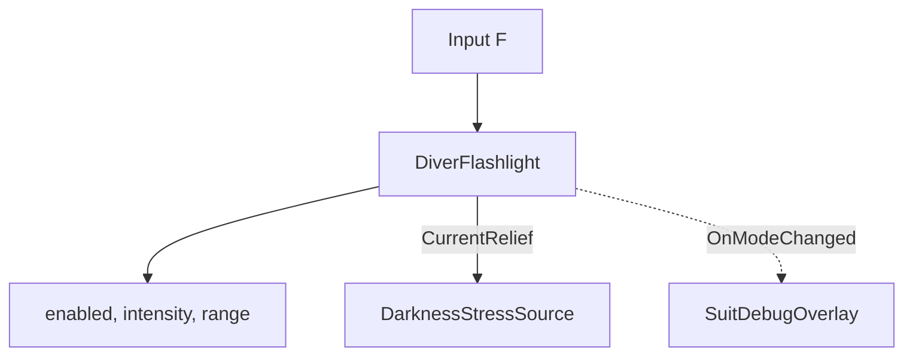

# Diver Flashlight
Ultima verifica: 2026-09-12

## Scopo e confini
Gestisce la torcia montata sullo scafandro del diver, permettendo la commutazione ciclica tra le modalità di illuminazione subacquea implementate (`Full`, `Low`, `Off`).
Oltre alla funzione visiva essenziale per orientarsi nell'abisso oceanico, la torcia fornisce una quota normalizzata di sollievo dallo stress da oscurità (`CurrentRelief`), letta direttamente da `DarknessStressSource`.

## File e componenti
- `Assets/_Project/Code/Player/Equipment/DiverFlashlight.cs`: MonoBehaviour che controlla la sorgente luminosa Unity (`Light`), gestisce gli input e calcola il sollievo dallo stress.
- `FlashlightMode` (enum definito in `DiverFlashlight.cs`): Definisce i tre stati operativi reali:
  - `Full`: Fascio diretto ad alta intensità e massima portata (`fullIntensity: 55f`, `fullRange: 15f`, `fullRelief: 1f`).
  - `Low`: Luce diffusa / interna a ridotta intensità e corto raggio (`lowIntensity: 8f`, `lowRange: 4f`, `lowRelief: 0.4f`).
  - `Off`: Torcia spenta (`spotLight.enabled = false`, `offRelief: 0f`).

## Dipendenze e flusso dati
- **Luce fisica**: Modifica `enabled`, `intensity` e `range` sul componente `Light` (URP Spot Light). Non modifica `spotAngle` né il tipo di luce. Se il riferimento alla `Light` è assente, lo stato logico e il calcolo del sollievo continuano a funzionare.
- **Darkness Stress**: Espone la proprietà `CurrentRelief` (1.0 in Full, 0.4 in Low, 0.0 in Off), letta da `DarknessStressSource` per mitigare l'accumulo di stress al buio.
- **Overlay UI**: Notifica il cambio modalità tramite l'evento `OnModeChanged` a `SuitDebugOverlay`.



## Componenti

### DiverFlashlight
- **Responsabilità e ciclo di vita**:
  - `Awake()`: Se `spotLight` non è assegnato, tenta di risolverlo nei figli con `GetComponentInChildren<Light>(true)`. Chiama quindi `SetMode(initialMode)`.
  - `Update()`: Rileva la pressione del tasto di commutazione torcia e chiama `CycleMode()`. Con New Input System il tasto F è hardcoded (`Keyboard.current.fKey.wasPressedThisFrame`); il campo serializzato `toggleKey` viene impiegato unicamente nel ramo legacy (`Input.GetKeyDown(toggleKey)`).
- **Campi Inspector**:
  - `Light spotLight` (default: `null`): Riferimento alla sorgente luminosa.
  - `FlashlightMode initialMode` (default: `FlashlightMode.Full`): Modalità attiva all'avvio.
  - `KeyCode toggleKey` (default: `KeyCode.F`): Tasto impiegato nel ramo legacy manager.
  - **Full - Fascio Diretto**:
    - `float fullIntensity` (default: `55f`).
    - `float fullRange` (default: `15f`).
    - `float fullRelief` (range: 0-1, default: `1f`).
  - **Low - Diffusa / Interna**:
    - `float lowIntensity` (default: `8f`).
    - `float lowRange` (default: `4f`).
    - `float lowRelief` (range: 0-1, default: `0.4f`).
  - **Off - Spenta**:
    - `float offRelief` (range: 0-1, default: `0f`).
  - **Debug (sola lettura)**:
    - `FlashlightMode currentMode`: Modalità corrente.
    - `float currentRelief`: Quota di sollievo corrente.
- **API pubbliche**:
  ```csharp
  FlashlightMode CurrentMode { get; }
  float CurrentRelief { get; }
  event Action<FlashlightMode> OnModeChanged;
  void CycleMode();
  void SetMode(FlashlightMode mode);
  ```
  - `OnModeChanged`: Invocato a ogni chiamata a `SetMode(mode)`, anche qualora la modalità richiesta coincida con quella già attiva.
  - `CycleMode()`: Esegue la transizione ciclica `Full → Low → Off → Full`.
  - `SetMode(FlashlightMode mode)`: Imposta la modalità, applica `enabled`, `intensity` e `range` alla `Light` (se presente), assegna `currentRelief` e invoca `OnModeChanged`.
- **Riferimenti obbligatori e comportamento se mancanti**:
  - `spotLight`: Se non assegnato, viene ricercato in `Awake()` tramite `GetComponentInChildren<Light>(true)`. Se non è presente alcun componente `Light`, il sistema opera comunque a livello logico aggiornando `CurrentMode` e `CurrentRelief` senza generare errori o bloccare l'esecuzione.

## Setup in Unity
1. Posizionare una `Light` (tipo Spot) sul GameObject della torcia (es. `TorchPivot`).
2. Aggiungere il componente `DiverFlashlight` sul diver.
3. Assegnare la `Light` nel campo `Spot Light` (oppure posizionarla come figlia per la risoluzione automatica).
4. Configurare `Initial Mode` (tipicamente `Full`).

## Configurazione verificata in prefab e scene
- Nel prefab [Player.prefab](file:///Z:/_PROJECTS/Unity/Project_Deep/Assets/_Project/Prefabs/Player.prefab):
  - Componente `DiverFlashlight` serializzato con:
    - `initialMode: 0` (`Full`).
    - `toggleKey: 102` (`KeyCode.F`).
    - `spotLight`: assegnato a `{fileID: 4979100799969987480}` nel pivot torcia.
    - `fullIntensity: 55`, `fullRange: 15`, `fullRelief: 1`.
    - `lowIntensity: 8`, `lowRange: 4`, `lowRelief: 0.4`.
    - `offRelief: 0`.

## Estensione del sistema
- Esaurimento batteria: aggiunta di un contatore energetico che forza la transizione a `Off` o riduce progressivamente l'intensità luminosa.
- Feedback sonoro: sottoscrivere `OnModeChanged` per riprodurre un click meccanico dello switch ad ogni commutazione.

## Limiti e problemi noti
- Se la torcia viene spenta (`Off`) o impostata su `Low` al di fuori di una `StressLightZone`, il sollievo scende rispettivamente a `0.0` o `0.4`, causando l'accumulo rapido dello stress da oscurità calcolato da `DarknessStressSource`.

## Sistemi collegati
- [PlayerInput.md](file:///Z:/_PROJECTS/Unity/Project_Deep/documentation/PlayerInput.md)
- [Stress.md](file:///Z:/_PROJECTS/Unity/Project_Deep/documentation/Stress.md)
- [DarknessStress-docs.md](file:///Z:/_PROJECTS/Unity/Project_Deep/documentation/DarknessStress-docs.md)
- [SuitFeedback.md](file:///Z:/_PROJECTS/Unity/Project_Deep/documentation/SuitFeedback.md)
