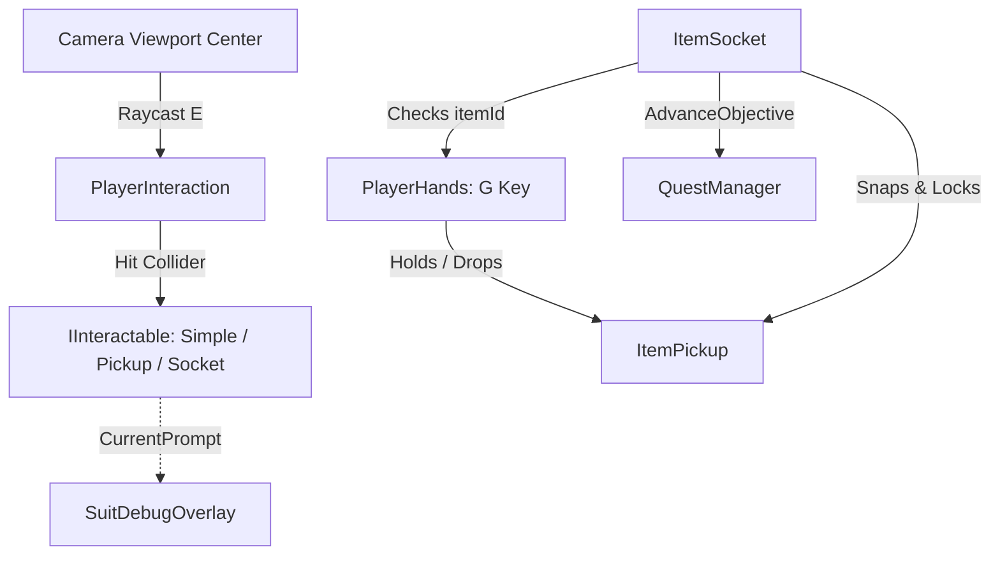

# Interaction System
Ultima verifica: 2026-09-13

## Scopo e confini
Gestisce l'interazione del diver con l'ambiente sottomarino: rilevamento tramite raycast visuale, visualizzazione dei prompt contestuali, attivazione di interruttori/oggetti generici (`SimpleInteractable`), raccolta e trasporto a mano di oggetti fisici (`ItemPickup`, `PlayerHands`) e loro alloggiamento in alloggiamenti specifici (`ItemSocket`).
Il sistema è collegato direttamente al sistema missioni (`QuestManager`) per avanzare gli obiettivi di gioco al completamento delle interazioni.

## File e componenti
- `Assets/_Project/Code/Interaction/IInteractable.cs`: Interfaccia contrattuale per qualsiasi oggetto interattivo nel mondo.
- `Assets/_Project/Code/Interaction/PlayerInteraction.cs`: Componente che esegue il raycast continuo dalla camera e intercetta il tasto di interazione ([E]).
- `Assets/_Project/Code/Interaction/PlayerHands.cs`: Gestore dell'oggetto trasportato nelle mani del diver, con presa e rilascio ([G]).
- `Assets/_Project/Code/Interaction/ItemPickup.cs`: Implementazione di `IInteractable` per oggetti raccoglibili, trasportabili e alloggiabili (es. celle energetiche).
- `Assets/_Project/Code/Interaction/ItemSocket.cs`: Alloggiamento che richiede uno specifico `acceptedItemId`, accoglie l'oggetto rilasciato dalle mani e notifica il puzzle/missione.
- `Assets/_Project/Code/Interaction/SimpleInteractable.cs`: Componente generico per pulsanti, valvole, leve o console con eventi Unity e avanzamento quest.

## Dipendenze e flusso dati
- **Camera Player**: `PlayerInteraction` proietta un raggio dal centro della viewport (`(0.5f, 0.5f, 0f)`).
- **Mani e Socket**: Quando il giocatore interagisce con un `ItemSocket`, questo interroga `PlayerHands`: se l'oggetto tenuto corrisponde all'`acceptedItemId`, l'oggetto viene rimosso dalle mani e vincolato allo snap point dello zoccolo.
- **Quest System**: `ItemPickup`, `ItemSocket` e `SimpleInteractable` possono avanzare uno specifico `questObjectiveId` in `QuestManager.Instance`.
- **UI / HUD**: `SuitDebugOverlay` osserva `PlayerInteraction` e `PlayerHands` per mostrare il prompt d'azione e il nome dell'oggetto tenuto.



## Componenti

### IInteractable
- **Interfaccia**:
  ```csharp
  public interface IInteractable
  {
      string PromptText { get; }
      bool CanInteract(GameObject user);
      void Interact(GameObject user);
  }
  ```

### PlayerInteraction
- **Responsabilità e ciclo di vita**:
  - `Awake()`: Risolve la camera di riferimento (`GetComponentInChildren<Camera>() ?? Camera.main`).
  - `Update()`: Chiama `PerformRaycast()` per aggiornare il target e `CheckInput()` per catturare il tasto `E` (`Keyboard.current.eKey` o `KeyCode.E`).
- **Campi Inspector**:
  - `float interactionDistance` (default: `2.6f` metri).
  - `LayerMask interactionLayers` (default: `~0` / Everything).
  - `KeyCode interactKey` (default: `KeyCode.E`).
  - `Camera playerCamera`: Camera usata per il raycast centrale.
  - `bool hasTarget` (debug sola lettura).
  - `string currentPrompt` (debug sola lettura).
- **API pubbliche**:
  - `event Action<IInteractable> OnTargetChanged`
  - `IInteractable CurrentTarget { get; }`
  - `bool HasTarget { get; }`
  - `string CurrentPrompt { get; }`

### PlayerHands
- **Responsabilità e ciclo di vita**:
  - `Awake()`: Se `holdPoint` è nullo, crea un GameObject `HoldPoint` posizionato a `(0.35, -0.32, 0.65)` rispetto alla camera.
  - `Update()`: Intercetta il tasto `G` (`Keyboard.current.gKey` o `KeyCode.G`) per chiamare `Drop()`.
- **Campi Inspector**:
  - `Transform holdPoint`: Punto di ancoraggio dell'oggetto nelle mani del diver.
  - `Vector3 defaultHoldOffset` (default: `(0.35f, -0.32f, 0.65f)`).
  - `KeyCode dropKey` (default: `KeyCode.G`).
  - `ItemPickup heldItem` (debug sola lettura).
- **API pubbliche**:
  - `event Action<ItemPickup> OnItemPickedUp`
  - `event Action<ItemPickup> OnItemDropped`
  - `ItemPickup CurrentItem { get; }`
  - `bool IsHoldingItem { get; }`
  - `bool Pickup(ItemPickup item)`: Assegna l'oggetto alle mani e ne disabilita la fisica.
  - `ItemPickup Drop()`: Rilascia l'oggetto riattivandone la gravità.
  - `ItemPickup ReleaseItemForSocket()`: Rilascia l'oggetto per alloggiarlo in un socket senza applicare spinte di caduta.

### ItemPickup
- **Responsabilità e ciclo di vita**:
  - Implementa `IInteractable`. Quando il giocatore preme [E], verifica se le mani sono libere ed esegue `hands.Pickup(this)`.
- **Campi Inspector**:
  - `string itemName` (default: `"Cella Energetica"`).
  - `string itemId` (default: `"power_cell"`): ID di matching per gli alloggiamenti.
  - `string pickupPrompt` (default: `"Raccogli Cella Energetica"`).
  - `string questObjectiveId`: ID obiettivo missioni opzionale.
  - `int questAdvanceAmount` (default: `1`).
- **API pubbliche**:
  - `void OnPickedUp(Transform holdParent)`: Disabilita `Rigidbody.isKinematic = true`, spegne i collider e imparenta al punto di presa.
  - `void OnDropped()`: Riabilita la fisica libera (`isKinematic = false`), riaccende i collider e applica un impulso in avanti.
  - `void OnSocketed(Transform snapPoint)`: Vincola l'oggetto nello zoccolo target e ne disattiva definitivamente l'interazione.

### ItemSocket
- **Responsabilità e ciclo di vita**:
  - Implementa `IInteractable`. Accetta solo l'oggetto con `itemId == acceptedItemId`.
- **Campi Inspector**:
  - `string acceptedItemId` (default: `"power_cell"`).
  - `Transform snapPoint`: Posizione esatta in cui alloggiare l'oggetto inserito.
  - `string emptyPrompt` (default: `"Inserisci Cella Energetica"`).
  - `string occupiedPrompt` (default: `"Slot Occupato"`).
  - `Light statusLight`: Luce di stato (es. LED dello zoccolo).
  - `Color emptyColor` (default: Rosso), `Color filledColor` (default: Verde).
  - `string questObjectiveId` (default: `"gen_power"`).
  - `int questAdvanceAmount` (default: `1`).
  - `UnityEvent<ItemPickup> onSocketFilled`: Evento per attivare macchinari, suoni o porte.
- **API pubbliche**:
  - `bool IsOccupied { get; }`
  - `ItemPickup SlottedItem { get; }`

### SimpleInteractable
- **Responsabilità e ciclo di vita**:
  - Implementa `IInteractable`. Attiva un evento generico (`UnityEvent onInteracted`) alla pressione di [E].
- **Campi Inspector**:
  - `string promptText` (default: `"Interagisci"`).
  - `bool isReusable` (default: `false`).
  - `bool isEnabled` (default: `true`).
  - `string questObjectiveId`: ID obiettivo opzionale.
  - `int questAdvanceAmount` (default: `1`).
  - `UnityEvent onInteracted`: Callback invocato all'interazione.
- **API pubbliche**:
  - `void SetInteractable(bool state)`: Abilita o disabilita l'interazione a runtime.
  - `public void SetPromptText(string text)`: Sostituisce `promptText` a runtime; accetta anche `null` e non modifica lo stato interagibile.

## Setup in Unity
1. Assicurarsi che `PlayerCapsule` abbia `PlayerInteraction` e `PlayerHands`.
2. Assegnare a entrambi la camera principale o lasciare che la individuino in `Awake()`.
3. Su qualsiasi oggetto interattivo aggiungere un `Collider` e il componente desiderato (`SimpleInteractable`, `ItemPickup`, o `ItemSocket`).

## Configurazione verificata in prefab e scene
- Nel prefab [Player.prefab](file:///Z:/_PROJECTS/Unity/Project_Deep/Assets/_Project/Prefabs/Player.prefab):
  - `PlayerInteraction` e `PlayerHands` sono preconfigurati.
- Nella scena `Prototype.unity` (rimossa il 2026-10-07 nel commit `f0fb87b`, recuperabile dalla storia di Git; configurazione non riverificata dopo la rimozione):
  - Le celle energetiche (`ItemPickup`) con `itemId = "power_cell"` e gli alloggiamenti del generatore (`ItemSocket`) con `acceptedItemId = "power_cell"` sono disposti nel settore d'inizio.

- Nella scena `SCN_Gameplay.unity` il portello della capsula (`MSH_Hatch_Door`) usa `SimpleInteractable` → `HatchDoor.Open`, con un trigger figlio `HatchInteractVolume` come bersaglio del raycast. Dettagli in [Environment.md](file:///Z:/_PROJECTS/Unity/Project_Deep/documentation/Environment.md).

Il binding Localization verso `SetPromptText` è pianificato ma non verificato in scena o Play Mode.

## Sistemi collegati
- [PlayerInput.md](file:///Z:/_PROJECTS/Unity/Project_Deep/documentation/PlayerInput.md)
- [SuitFeedback.md](file:///Z:/_PROJECTS/Unity/Project_Deep/documentation/SuitFeedback.md)
- [Quests.md](file:///Z:/_PROJECTS/Unity/Project_Deep/documentation/Quests.md)
