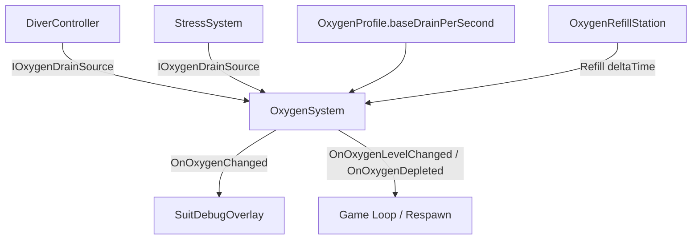

# Oxygen System
Ultima verifica: 2026-09-12

## Scopo e confini
Gestisce la riserva vitale di ossigeno (O₂) nello scafandro del diver. L'ossigeno viene costantemente consumato dal metabolismo basale della tuta e subisce incrementi di drenaggio derivanti dallo sforzo motorio (`DiverController`) e dal livello di agitazione psicologica (`StressSystem`).
Il sistema è completamente disaccoppiato dalle singole sorgenti tramite l'interfaccia `IOxygenDrainSource`. Quando l'ossigeno si esaurisce, notifica l'evento critico per la gestione del fallimento o del soffocamento.

## File e componenti
- `Assets/_Project/Code/Player/Oxygen/OxygenSystem.cs`: Gestore principale della quantità di O₂, del consumo, del refill e degli stati di allerta.
- `Assets/_Project/Code/Player/Oxygen/OxygenProfile.cs`: ScriptableObject con la configurazione di capacità, consumi base e soglie critiche.
- `Assets/_Project/Code/Player/Oxygen/IOxygenDrainSource.cs`: Interfaccia implementata da qualsiasi sistema che consuma ossigeno in unità/secondo.
- `OxygenLevel` (enum definito in `OxygenSystem.cs`): Livello di severità della riserva (`Normal`, `Warning`, `Critical`, `Depleted`).

## Dipendenze e flusso dati
- **Sorgenti di consumo**: Registra automaticamente o via codice ogni componente che implementa `IOxygenDrainSource` (nello specifico: `DiverController` per il moto e `StressSystem` per il panico).
- **Ricarica**: Interagisce con le stazioni ambientali come `OxygenRefillStation` tramite `Refill(float deltaTime)`.
- **UI & Feedback**: Notifica la variazione normalizzata a `SuitDebugOverlay` via `OnOxygenChanged`.



## Componenti

### OxygenSystem
- **Responsabilità e ciclo di vita**:
  - `Awake()`: Tenta di caricare il profilo `profile`. Cerca tutte le istanze di `IOxygenDrainSource` nei componenti figli (`GetComponentsInChildren<IOxygenDrainSource>(true)`). Inizializza `currentOxygen` alla capacità massima (`profile.maxOxygen`).
  - `Update()`: Calcola la somma di tutti i drain attivi + `profile.baseDrainPerSecond`. Se il diver non è in ricarica, decrementa `currentOxygen` per `Time.deltaTime` e verifica le transizioni di `OxygenLevel`.
- **Campi Inspector**:
  - `OxygenProfile profile`: Configurazione dei valori di O₂.
  - `float currentOxygen` (debug sola lettura): Quantità attuale di litri/unità O₂.
  - `float currentDrainPerSecond` (debug sola lettura): Consumo istantaneo totale al secondo.
  - `OxygenLevel currentLevel` (debug sola lettura): Livello di rischio corrente.
- **API pubbliche**:
  - `event Action<float> OnOxygenChanged`: Evento con percentuale normalizzata (0.0 a 1.0).
  - `event Action<OxygenLevel> OnOxygenLevelChanged`: Invocato al superamento delle soglie `Normal`, `Warning`, `Critical`, `Depleted`.
  - `event Action OnOxygenDepleted`: Invocato quando l'ossigeno tocca 0.
  - `float CurrentOxygen { get; }`
  - `float MaxOxygen { get; }`
  - `float NormalizedOxygen { get; }`
  - `float CurrentDrainPerSecond { get; }`
  - `OxygenLevel CurrentLevel { get; }`
  - `bool IsDepleted { get; }`
  - `void RegisterDrainSource(IOxygenDrainSource source)`: Aggiunge dinamicamente una fonte di consumo.
  - `void UnregisterDrainSource(IOxygenDrainSource source)`: Rimuove una fonte di consumo.
  - `void Refill(float deltaTime)`: Ricarica la riserva calcolando `profile.refillRatePerSecond * deltaTime`.
  - `void SetOxygenDirect(float value)`: Forza un valore assoluto di O₂ (utile per debug o checkpoint).
- **Riferimenti obbligatori e comportamento se mancanti**:
  - Se `profile` è nullo, stampa `Debug.LogError` e disabilita il componente.

### OxygenProfile
- **Responsabilità e ciclo di vita**:
  - `ScriptableObject` che definisce i limiti fisici della bombola della tuta.
- **Campi Inspector**:
  - `float maxOxygen` (default: `100f` unità/litri, range consigliato 50-300).
  - `float baseDrainPerSecond` (default: `0.25f` unità/s al minuto basale: ~400s di autonomia fermi).
  - `float refillRatePerSecond` (default: `15f` unità/s durante la ricarica alla stazione).
  - `float warningThreshold` (default: `0.35f` = 35% di riserva rimanente).
  - `float criticalThreshold` (default: `0.15f` = 15% di riserva rimanente).

### IOxygenDrainSource
- **Interfaccia**:
  ```csharp
  public interface IOxygenDrainSource
  {
      float GetOxygenDrainPerSecond();
  }
  ```
  Permette a qualsiasi modulo futuro (es. fughe dalla tuta, ferite, freddo estremo, attrezzi pneumatici) di sottrarre ossigeno senza accoppiarsi strettamente all'`OxygenSystem`.

## Setup in Unity
1. Aggiungere `OxygenSystem` al GameObject radice del player (`PlayerCapsule`).
2. Creare o assegnare un asset `OxygenProfile` (es. `OxygenProfile_Standard.asset`).
3. Assicurarsi che i componenti che implementano `IOxygenDrainSource` (`DiverController`, `StressSystem`) si trovino sul GameObject o nei suoi figli.

## Configurazione verificata in prefab e scene
- In [Player.prefab](file:///Z:/_PROJECTS/Unity/Project_Deep/Assets/_Project/Prefabs/Player.prefab):
  - `OxygenSystem` è posizionato sulla radice.
  - Riceve drain da `DiverController` (camminata/corsa) e da `StressSystem` (panico da buio/movimenti bruschi).

## Estensione del sistema
- Riconoscimento bombole secondarie / upgrade di capacità: sostituzione o modifica dinamica del profilo di capienza.
- Effetto soffocamento: sottoscrivere `OnOxygenDepleted` per avviare il blackout e il reload dal checkpoint.

## Limiti e problemi noti
- Se il diver entra in una stazione di ricarica (`OxygenRefillStation`), questa chiama `Refill(Time.deltaTime)` in `OnTriggerStay()`. La stazione ha un proprio parametro serializzato `refillRatePerSecond` che attualmente non viene usato, in quanto la velocità effettiva è governata da `OxygenProfile.refillRatePerSecond`.

## Sistemi collegati
- [PlayerMovement.md](file:///Z:/_PROJECTS/Unity/Project_Deep/documentation/PlayerMovement.md)
- [Stress.md](file:///Z:/_PROJECTS/Unity/Project_Deep/documentation/Stress.md)
- [Environment.md](file:///Z:/_PROJECTS/Unity/Project_Deep/documentation/Environment.md)
- [SuitFeedback.md](file:///Z:/_PROJECTS/Unity/Project_Deep/documentation/SuitFeedback.md)
