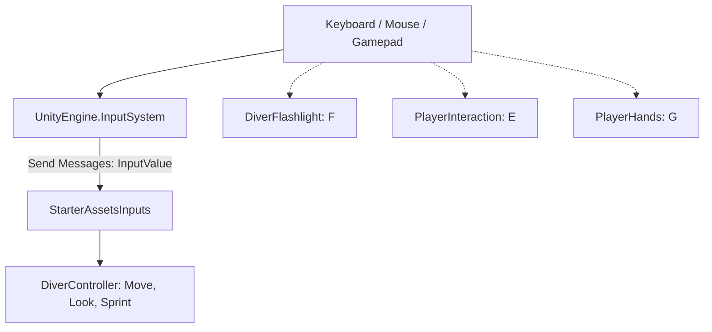

# Player Input
Ultima verifica: 2026-09-12

## Scopo e confini
Raccoglie ed espone i vettori di movimento, mira e gli stati dei tasti primari del diver (`move`, `look`, `sprint`, `jump`, `jumpDown`). Funge da ricevitore dei messaggi inviati dal componente Unity `PlayerInput` con il New Input System (`UnityEngine.InputSystem`), memorizzando i valori ricevuti tramite callback o setter pubblici.
Non implementa logica fisica o interpolazioni del movimento, non contiene un fallback legacy autonomo e non gestisce direttamente le azioni secondarie contestuali.

## File e componenti
- `Assets/_Project/Code/Player/Input/StarterAssetsInputs.cs`: Componente MonoBehaviour che espone campi pubblici per i dati di input e gestisce il locking del puntatore del mouse.

## Dipendenze e flusso dati
- **UnityEngine.InputSystem**: I metodi `OnMove`, `OnLook`, `OnJump`, `OnSprint` ricevono oggetti `InputValue` tramite il meccanismo `Send Messages` del componente Unity `PlayerInput`.
- **Consumatori**:
  - `DiverController`: Interroga `move`, `look` e `sprint`.
  - Componenti dedicati (`DiverFlashlight`, `PlayerInteraction`, `PlayerHands`) gestiscono autonomamente i propri tasti d'azione (F, E, G): nel New Input System leggono direttamente i tasti hardcoded da `Keyboard.current`, mentre i rispettivi campi `KeyCode` configurano unicamente i rami legacy fallback.



## Componenti

### StarterAssetsInputs
- **Responsabilità e ciclo di vita**:
  - `OnApplicationFocus(bool hasFocus)`: Ripristina lo stato del cursore (`CursorLockMode.Locked` / `CursorLockMode.None`) in base al flag `cursorLocked`.
  - Riceve gli input dal `PlayerInput` di Unity attraverso callback `On*` con argomento `InputValue`.
- **Campi Inspector**:
  - `Vector2 move`: Vettore orizzontale di movimento (X = strafe, Y = avanti/indietro).
  - `Vector2 look`: Delta di rotazione del mouse o stick analogico.
  - `bool jump`: Stato continuo del tasto salto (true finché mantenuto premuto).
  - `bool jumpDown`: Flag di rising edge. Diventa `true` sul fronte di salita della pressione e viene azzerato unicamente al rilascio del tasto (`jumpDown = false` quando `newJumpState` è false); non si azzera automaticamente al frame successivo.
  - `bool sprint`: Stato continuo del tasto sprint (Shift).
  - `bool analogMovement` (default: `false`): Flag booleano serializzato esposto per i consumatori (il componente non esegue alcuna interpolazione interna).
  - `bool cursorLocked` (default: `true`): Blocca il mouse al centro della schermata.
  - `bool cursorInputForLook` (default: `true`): Permette di abilitare o disabilitare l'acquisizione del look da puntatore.
- **API pubbliche**:
  - Firme condizionate al preprocessore `#if ENABLE_INPUT_SYSTEM`:
    ```csharp
    void OnMove(InputValue value);
    void OnLook(InputValue value);
    void OnJump(InputValue value);
    void OnSprint(InputValue value);
    ```
  - Metodi setter pubblici:
    ```csharp
    void MoveInput(Vector2 newMoveDirection);
    void LookInput(Vector2 newLookDirection);
    void JumpInput(bool newJumpState);
    void SprintInput(bool newSprintState);
    ```
- **Riferimenti obbligatori e comportamento se mancanti**:
  - Se il New Input System non è attivo (`ENABLE_INPUT_SYSTEM` disattivato), i metodi `On*` basati su `InputValue` non vengono compilati.

## Punti di lettura input negli altri sistemi
1. **DiverController**:
   - `input.move`: Direzione target di moto sul piano XZ.
   - `input.look`: Calcolo di yaw e pitch con damping.
   - `input.sprint`: Modula la velocità (walk/sprint) e il consumo addizionale di O₂.
2. **DiverFlashlight**:
   - Tasto F: chiama `CycleMode()`, sequenza Full → Low → Off → Full. Nel ramo legacy il tasto è configurabile tramite `toggleKey`.
3. **PlayerInteraction**:
   - Tasto E: hardcoded su `Keyboard.current.eKey` nel New Input System; configurabile tramite `interactKey` nel ramo legacy.
4. **PlayerHands**:
   - Tasto G: hardcoded su `Keyboard.current.gKey` nel New Input System; configurabile tramite `dropKey` nel ramo legacy.

## Setup in Unity
1. Aggiungere `StarterAssetsInputs` al GameObject `PlayerCapsule`.
2. Aggiungere il componente Unity `PlayerInput` e selezionare l'asset `StarterAssets.inputactions`.
3. Impostare la proprietà **Behavior** di `PlayerInput` su **Send Messages** (necessario affinché Unity inoltri i messaggi `OnMove`, `OnLook`, `OnJump`, `OnSprint` con parametro `InputValue`).
4. Verificare che `cursorLocked` e `cursorInputForLook` siano impostati su `true`.

## Configurazione verificata in prefab e scene
- Nel prefab [Player.prefab](file:///Z:/_PROJECTS/Unity/Project_Deep/Assets/_Project/Prefabs/Player.prefab):
  - `StarterAssetsInputs` è posizionato sulla radice `PlayerCapsule` insieme a `PlayerInput` (Behavior: Send Messages).

## Limiti e problemi noti
- Le azioni secondarie (torcia F, interazione E, drop G) sono cablate via codice direttamente sui singoli tasti della tastiera nei rispettivi script invece di utilizzare Action Map dedicate nell'asset `.inputactions`.

## Sistemi collegati
- [PlayerMovement.md](file:///Z:/_PROJECTS/Unity/Project_Deep/documentation/PlayerMovement.md)
- [Flashlight.md](file:///Z:/_PROJECTS/Unity/Project_Deep/documentation/Flashlight.md)
- [Interaction.md](file:///Z:/_PROJECTS/Unity/Project_Deep/documentation/Interaction.md)
