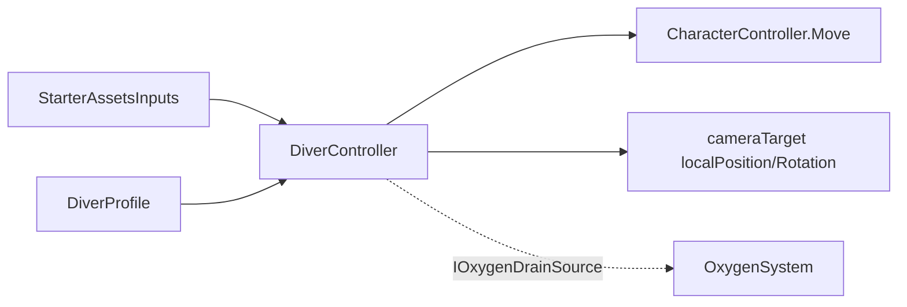

# Player Movement
Ultima verifica: 2026-10-09

## Scopo e confini
Gestisce la locomozione sul fondale marino del diver in scafandro pesante ispirata a *SOMA*. Non prevede salto convenzionale né manovre 6DOF in acqua libera: il movimento è vincolato al contatto col fondale tramite `CharacterController`, con inerzia percepibile, roll/pitch del casco e head-bob sinusoidale legato al passo. L'Hydropack per il traversal verticale è pianificato come componente a sé stante sbloccabile in seguito.
Il sistema calcola lo sforzo fisico del movimento e lo espone come fonte di consumo di ossigeno (`IOxygenDrainSource`).

## File e componenti
- `Assets/_Project/Code/Player/Movement/DiverController.cs`: MonoBehaviour principale per la fisica, la camminata, il bobbing della camera e l'emissione del drain O₂.
- `Assets/_Project/Code/Player/Movement/DiverProfile.cs`: ScriptableObject per la configurazione dei parametri fisici, cinematici, head-bob e consumo O₂.
- `Assets/_Project/Code/Player/Movement/BasicRigidBodyPush.cs`: Utility per spingere oggetti fisici (`Rigidbody`) collidendo con il `CharacterController`.

## Dipendenze e flusso dati
- **Input**: Legge `StarterAssetsInputs` (`move`, `look`, `sprint`) sullo stesso GameObject.
- **Fisica**: `CharacterController.Move()` chiamato in `Update()`.
- **Camera Root**: Modifica la posizione locale di `cameraTarget` in `Update()` per l'oscillazione del passo (head-bob), e ruota il diver (yaw su Transform orizzontale) e il target (pitch verticale) in `LateUpdate()`.
- **Ossigeno**: Implementa `IOxygenDrainSource.GetOxygenDrainPerSecond()`, interrogato da `OxygenSystem`.

## Componenti

### DiverController
- **Responsabilità e ciclo di vita**:
  - `Awake()`: Cache di `CharacterController`, `StarterAssetsInputs`, posizione neutra di `cameraTarget`, validazione profilo.
  - `Update()`: Controllo fondale (`GroundedCheck`), calcolo gravità (`ApplyGravity`), calcolo velocità e moto con inerzia (`Move`), applicazione head-bob prima del campionamento Cinemachine (`ApplyHeadBob`).
  - `LateUpdate()`: Rotazione visuale yaw del diver e pitch del casco (`RotateView`).

- **Campi Inspector**:
  - `DiverProfile profile` (default: `null`): Riferimento obbligatorio alla configurazione fisica.
  - `Transform cameraTarget` (default: `null`): Target di rotazione verticale della camera (pitch del casco).
  - `LayerMask groundLayers` (default: `~0` / Everything): Layer considerati fondale calpestabile.
  - `float groundedOffset` (default: `-0.14f`): Offset verticale della sfera di contatto col fondale rispetto alla base della capsula.
  - `float groundedRadius` (default: `0.5f`): Raggio della sfera di contatto col fondale.
  - `bool grounded` (debug sola lettura): Indica se il diver poggia sul fondale.
  - `float currentSpeed` (debug sola lettura): Velocità scalare orizzontale attuale in m/s.
  - `bool lockMovement` (default: `false`): Se abilitato, blocca la locomozione orizzontale e l'accelerazione mantenendo attiva la rotazione della visuale (freelook) e la gravità.
- **API pubbliche**:
  - `bool LockMovement { get; set; }`: Proprietà per attivare/disattivare il blocco della locomozione; quando impostata a `true`, azzera immediatamente `horizontalVelocity` e `currentSpeed`.
  - `Vector3 CameraBasePosition { get; set; }`: Quota e offset base della camera (altezza occhi eretta standard).
  - `Transform CameraTarget { get; }`: Il `cameraTarget` assegnato in Inspector, per le sequenze scriptate che animano la testa (`PlayerWakeUpSequence`, `HatchExit`).
  - `float ViewRoll { get; set; }` (default 0): Roll fisso della visuale in gradi, sommato a quello del head-bob in `RotateView()` e in `ResetMotion()`. Usato da seduto sul sedile inclinato della capsula; `HatchExit` lo riporta a 0.
  - `void SetViewPitch(float pitch)`: Imposta pitch corrente e target della visuale senza smorzamento (limitato da `lookDownLimit`/`lookUpLimit`), per riprendere il controllo dalla posa di una sequenza senza scatti.
  - `event Action OnFootstep`: Invocato a ogni appoggio del piede a terra durante la falcata.
  - `float CurrentSpeed { get; }`: Restituisce `currentSpeed`.
  - `bool IsGrounded { get; }`: Restituisce `grounded`.
  - `float GetOxygenDrainPerSecond()`: Calcola il consumo di O₂ in base a andatura (walk/sprint) e velocità effettiva (`effortDrain * (currentSpeed / profile.sprintSpeed)`).
  - `public void ResetMotion()`: Azzera velocità orizzontale/verticale, velocità corrente, ciclo/peso/roll del bob e passo pendente; riallinea i target di yaw/pitch allo stato corrente e riporta `cameraTarget` alla posa base (posizione `CameraBasePosition`, rotazione pitch corrente e `ViewRoll`). Non teletrasporta il player.
  - Con il `CharacterController` disattivato `Move()` non fa nulla (nessuna chiamata a `CharacterController.Move`); gravità, head-bob e rotazione della visuale continuano. È lo stato del diver seduto nella capsula.
  - `CharacterController`: Richiesto tramite `[RequireComponent]`.
  - `profile`: Se nullo genera `Debug.LogError` e disabilita il componente in `Awake()`.
  - `cameraTarget`: Se nullo, l'head-bobbing e il pitch del casco non possono essere applicati.

### DiverProfile
- **Responsabilità e ciclo di vita**:
  - `ScriptableObject` serializzato come asset `.asset`.
- **Campi Inspector**:
  - **Andatura**:
    - `float walkSpeed` (range: 0.5-4, default: `1.6f` m/s).
    - `float sprintSpeed` (range: 0.5-6, default: `2.8f` m/s).
  - **Inerzia**:
    - `float acceleration` (range: 0.5-12, default: `2.2f`).
    - `float deceleration` (range: 0.5-12, default: `1.6f`).
  - **Assetto sul fondale**:
    - `float gravity` (range: -20 a -1, default: `-4.5f` m/s²: peso meno spinta idrostatica).
    - `float terminalVelocity` (range: 1-20, default: `6.0f` m/s).
  - **Visuale (casco)**:
    - `float lookSensitivity` (range: 0.1-5, default: `1.0f`).
    - `float lookDamping` (range: 1-40, default: `12.0f`).
    - `float lookUpLimit` (range: 0-90, default: `70.0f` gradi).
    - `float lookDownLimit` (range: -90 a 0, default: `-70.0f` gradi).
    - `bool invertLookY` (default: `false`).
  - **Oscillazione del passo (Head-bob)**:
    - `bool enableHeadBob` (default: `true`).
    - `float bobStrideLength` (range: 0.5-5, default: `1.8f` metri per ciclo completo destro/sinistro).
    - `float bobVerticalAmplitude` (range: 0-0.3, default: `0.055f` m).
    - `float bobLateralAmplitude` (range: 0-0.3, default: `0.035f` m).
    - `float bobRollAmplitude` (range: 0-5, default: `0.8f` gradi).
    - `float bobSettleSpeed` (range: 1-20, default: `6.0f`).
  - **Consumo ossigeno**:
    - `float walkOxygenDrain` (range: 0-5, default: `0.4f` O₂/s).
    - `float sprintOxygenDrain` (range: 0-10, default: `1.6f` O₂/s).

### BasicRigidBodyPush
- **Responsabilità e ciclo di vita**:
  - Riceve `OnControllerColliderHit(ControllerColliderHit hit)` e applica forza impulsiva orizzontale a corpi rigidi non cinematici appartenenti ai layer abilitati.
- **Campi Inspector**:
  - `LayerMask pushLayers`: Layer degli oggetti spingibili.
  - `bool canPush` (default: `false` nel sorgente C#, configurabile nell'Inspector).
  - `float strength` (range: 0.5-5, default: `1.1f`).

## Setup in Unity
1. Aggiungere il componente `DiverController` al GameObject `PlayerCapsule` dotato di `CharacterController`.
2. Assegnare un asset `DiverProfile` nel campo `Profile`.
3. Assegnare il nodo `PlayerCameraRoot` al campo `Camera Target`.
4. Assegnare `StarterAssetsInputs` sullo stesso GameObject.
5. Verificare che il `CharacterController` abbia altezza ~1.8m, raggio ~0.5m e skin width 0.08m.

## Configurazione verificata in prefab e scene
- Nel prefab [Player.prefab](file:///Z:/_PROJECTS/Unity/Project_Deep/Assets/_Project/Prefabs/Player.prefab):
  - `DiverController` è configurato con `DiverProfile_Heavy` (`Assets/_Project/Profiles/DiverProfile_Heavy.asset`).
  - `Camera Target` punta a `PlayerCameraRoot`.
  - `ApplyHeadBob` è eseguito in `Update()`, garantendo la sincronizzazione prima di Cinemachine in `LateUpdate()`.

## Estensione del sistema
- Integrazione modulo Hydropack: creare un componente separato `DiverHydropack` che modifica o sovrascrive la componente verticale della velocità (`verticalVelocity`) consumando risorsa separata (propellente/energia).
- Emissione suoni passi: sottoscrivere `OnFootstep` da un modulo audio per instanziare o riprodurre clip di passi metallici/fangosi sul fondale.

## Limiti e problemi noti
- Se Cinemachine legge il `PlayerCameraRoot` prima o durante `Update()`, l'ordine dei componenti o dell'execution order può alterare la stabilità della camera. Il fix consolidato applica l'head-bob in `Update()` e la rotazione in `LateUpdate()`.

## Verifica
- 2026-10-09, Play Mode in `SCN_Gameplay` (Unity 6000.3.19f1): `CameraTarget`, `ViewRoll`, `SetViewPitch(0)` e `ResetMotion()` usati da `PlayerWakeUpSequence` e `HatchExit`. Passaggio di controllo senza scatti nei valori di posizione, pitch e roll della camera; da seduto `ViewRoll` 16.8° mantenuto dal controller; nessun errore `CharacterController.Move` con il controller spento. Camminata dopo l'uscita non riverificata con input reale.
- Avviare la scena `SCN_Gameplay.unity` in Play Mode.
- Camminando con W/A/S/D si deve avvertire l'accelerazione graduale e il dondolio della visuale.
- Al rilascio dei comandi la decelerazione produce uno scivolamento breve.
- In sprint (Shift) il consumo di O₂ riportato nell'overlay debug cresce proporzionalmente alla velocità.

## Sistemi collegati
- [PlayerInput.md](file:///Z:/_PROJECTS/Unity/Project_Deep/documentation/PlayerInput.md)
- [Oxygen.md](file:///Z:/_PROJECTS/Unity/Project_Deep/documentation/Oxygen.md)
- [CameraFollowThrough.md](file:///Z:/_PROJECTS/Unity/Project_Deep/documentation/CameraFollowThrough.md)
- [SuitFeedback.md](file:///Z:/_PROJECTS/Unity/Project_Deep/documentation/SuitFeedback.md)
