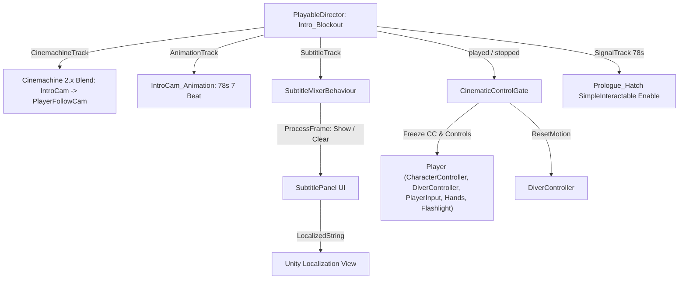

# Prologue
Ultima verifica: 2026-10-09

## Scopo e confini
Fornisce i componenti C#, le estensioni Timeline e l'infrastruttura della Wave 1 per la sequenza cinematica introduttiva di *Deeplonauts*: regia a telecamera dedicata (Cinemachine 2.10.7), sottotitoli localizzati su traccia custom, blocco e sblocco sincronizzato della fisica/input del player (`CinematicControlGate`) e transizione al portello dell'ascensore in scena unica `SCN_Gameplay.unity`.

## File e componenti
- `Assets/_Project/Code/Prologue/CinematicControlGate.cs`: Cancello di controllo per disabilitare/ripristinare i componenti del player, congelare il `CharacterController` e azzerare il moto in sincronia con `PlayableDirector`.
- `Assets/_Project/Code/Prologue/ElevatorPrologueSequence.cs`: Sequencer per la scena isolata dell'ascensore (`SCN_Intro.unity`): blocco locomozione con freelook, treadmill di cubi esterni dall'oblò, screenshake continuo e da impatto, sequenza sottotitoli a battute, dissolvenza a nero e caricamento asincrono/sincrono del gameplay loop.
- `Assets/_Project/Code/Prologue/PlayerWakeUpSequence.cs`: Componente per la sequenza di rinvenimento in `SCN_Gameplay.unity`, con il diver agganciato al sedile della capsula: partenza da schermo nero con la testa reclinata, dissolvenza in apertura, battuta di riavvio tuta, testa che si rialza ruotando su X attorno al collo, restituzione della visuale con il diver ancora seduto.
- `Assets/_Project/Code/Prologue/SubtitleLine.cs`: ScriptableObject per singola battuta con testi e speaker localizzati tramite Unity Localization.
- `Assets/_Project/Code/Prologue/SubtitlePanel.cs`: MonoBehaviour per visualizzazione UI a schermo delle battute localizzate.
- `Assets/_Project/Code/Prologue/SubtitleTrack.cs`: TrackAsset Timeline custom per il binding con `SubtitlePanel` e la creazione del mixer.
- `Assets/_Project/Code/Prologue/SubtitleClip.cs`: PlayableAsset che incapsula un `SubtitleLine` come clip Timeline.
- `Assets/_Project/Code/Prologue/SubtitleBehaviour.cs`: PlayableBehaviour di runtime associato alla singola clip di sottotitolo.
- `Assets/_Project/Code/Prologue/SubtitleMixerBehaviour.cs`: PlayableBehaviour mixer di traccia per il blending e la visualizzazione/pulizia dei sottotitoli a runtime.

## Dipendenze e flusso dati
- **Unity Localization (`com.unity.localization`)**: `SubtitleLine` e `SubtitlePanel` utilizzano `LocalizedString` e `LocalizeStringEvent`.
- **Unity Playables & Timeline (`UnityEngine.Timeline`, `UnityEngine.Playables`)**:
  - `SubtitleTrack` produce `SubtitleMixerBehaviour` che pilota `SubtitlePanel.Show()` e `SubtitlePanel.Clear()`.
  - `CinematicControlGate` monitora gli stati `played`, `stopped` e lo stato runtime di `PlayableDirector`.
  - `CinemachineTrack` controlla la transizione continua tra la camera cinematica (`Prologue_IntroCamera`) e la camera gameplay (`PlayerFollowCamera`).
- **Player & Input**:
  - `CinematicControlGate` congela `CharacterController.enabled`, disabilita la lista `controls` (`PlayerInput`, `DiverController`, `PlayerInteraction`, `PlayerHands`, `DiverFlashlight`), azzera gli assi di `StarterAssetsInputs` e invoca `DiverController.ResetMotion()`.

## Componenti

### CinematicControlGate
- **Responsabilità e ciclo di vita**:
  - Cancello di sincronizzazione tra cutscene su `PlayableDirector` e libertà d'azione del player.
  - `Awake()`: Valida che `director`, `diver`, `input`, `subtitles` e l'array `controls` siano assegnati e privi di null o riferimenti circolari. Valida che `controls` contenga `PlayerInput`, `DiverController`, `PlayerInteraction`, `PlayerHands` e `DiverFlashlight`. Risolve e memorizza il riferimento al `CharacterController` del diver.
  - `OnEnable()`: Sottoscrive `director.played += OnPlayed` e `director.stopped += OnStopped`. Se il director è già in esecuzione (`PlayState.Playing`), invoca immediatamente `Lock()`.
  - `OnDisable()`: Rimuove i listener su `director` ed esegue `Unlock()` di sicurezza.
  - `Start()` e `Update()`: Controllo difensivo per intercettare l'avvio della Timeline in modalità `playOnAwake = true` qualora l'evento `director.played` venga emesso prima della sottoscrizione.
- **Campi Inspector**:
  - `PlayableDirector director` (default: `null`): Director della sequenza narrativa o cutscene da ascoltare.
  - `DiverController diver` (default: `null`): Riferimento al controller del player per l'azzeramento della dinamica.
  - `StarterAssetsInputs input` (default: `null`): Riferimento agli input per l'azzeramento di assi e trigger.
  - `SubtitlePanel subtitles` (default: `null`): Riferimento al visualizzatore dei sottotitoli per la pulizia a fine riproduzione.
  - `Behaviour[] controls` (default: `new Behaviour[0]`): Componenti del player da disabilitare durante la cutscene.
- **API pubbliche**:
  - `public bool IsLocked { get; private set; }`: Stato corrente del cancello cinematico.
  - `public void Lock()`: Snapshot dello stato di abilitazione di ogni elemento in `controls`, disabilitazione di tutti i comportamenti, disabilitazione del `CharacterController` (per prevenire cadute/compenetrazioni fisiche durante animazioni della camera), azzeramento degli input e invocazione di `diver.ResetMotion()`. Chiamate ripetute non sovrascrivono lo snapshot iniziale.
  - `public void Unlock()`: Ripristino dello stato originale di ciascun componente tramite lo snapshot salvato, riabilitazione del `CharacterController`, azzeramento degli input residui, nuovo `ResetMotion()` e invocazione di `subtitles.Clear()`.
- **Riferimenti obbligatori e comportamento se mancanti**:
  - `director`, `diver`, `input`, `subtitles` e `controls` non nulli; `controls` deve contenere tutti i componenti chiave del diver. Se mancanti, il componente registra un errore critico e si disabilita in `Awake()`.

### ElevatorPrologueSequence
- **Responsabilità e ciclo di vita**:
  - Coordina la discesa della cabina ascensore nella scena `SCN_Intro.unity`.
  - `Awake()`: Risolve i riferimenti al diver, al `cameraTarget` (`PlayerCameraRoot`) e inizializza l'alpha del `fadeOverlay` a 0.
  - `Start()`: Imposta `diver.LockMovement = true` per bloccare la traslazione orizzontale preservando il freelook con mouse/stick, e genera i cubi procedurali del treadmill esterno.
  - `Update()`: Avanza il timer della discesa, attiva le battute di dialogo (`dialogueCues`) su `SubtitlePanel` nei timestamp prefissati, aggiorna la posizione dei cubi esterni (wrap-around ciclico) e gestisce il decadimento dello screenshake.
  - `LateUpdate()`: Applica lo screenshake procedurale continuo su `cameraTarget` (rumore Perlin a frequenza calibrata) e lo scossone violento ad alta frequenza al momento dell'impatto (`TriggerImpact`).
  - Coroutine `FadeAndLoadSceneRoutine`: Dissolve a nero il `fadeOverlay` e carica la scena target (`SCN_Gameplay`).
- **Campi Inspector**:
  - `DiverController diver`: Riferimento al diver per il lock del moto.
  - `Transform cameraTarget`: Riferimento alla camera del player per l'applicazione degli offset di screenshake.
  - `SubtitlePanel subtitlePanel`: Pannello UI per mostrare le battute narrative.
  - `CanvasGroup fadeOverlay`: Overlay a schermo intero per la dissolvenza a nero.
  - `List<DialogueCue> dialogueCues`: Lista di battute temporizzate con timestamp, durata e `SubtitleLine`.
  - `int cubeCount` (default: 14): Numero di cubi generati all'esterno dell'oblò.
  - `float cubeSpeed` (default: 9.0f): Velocità di scorrimento verticale dei cubi.
  - `bool invertCubeDirection` (default: false): Inverte la direzione di moto dei cubi.
  - `float descentShakePos` (default: 0.025f) / `descentShakeRot` (default: 0.45f): Intensità dello screenshake continuo durante la discesa.
  - `float impactTimestamp` (default: 30.0f): Secondo in cui si verifica l'impatto sul fondale.
  - `float impactShakePos` (default: 0.40f) / `impactShakeRot` (default: 4.0f): Intensità del trauma da impatto.
  - `float fadeDuration` (default: 1.8f): Durata della dissolvenza prima del cambio scena.
  - `string nextSceneName` (default: `"SCN_Gameplay"`): Scena di gameplay da caricare all'impatto.
- **API pubbliche**:
  - `public void TriggerImpact()`: Innesca immediatamente il trauma da impatto e la coroutine di dissolvenza/caricamento scena.

### PlayerWakeUpSequence
- **Responsabilità e ciclo di vita**:
  - Esegue il rinvenimento del giocatore in `SCN_Gameplay.unity` con il diver seduto e agganciato al sedile della capsula schiantata. `[DefaultExecutionOrder(100)]`: scrive `PlayerCameraRoot` in `LateUpdate` dopo `DiverController` (0) e prima di `RotationalFollowThrough` (200), vedi [CameraFollowThrough.md](file:///Z:/_PROJECTS/Unity/Project_Deep/documentation/CameraFollowThrough.md).
  - La posa da svenuto si authora ruotando il `PlayerCapsule` in scena. Con `readPoseFromTransform`, in `Awake()` la rotazione del diver si scompone rispetto al solo yaw: la componente su X diventa `slumpPitch` (testa reclinata), quella su Z `slumpRoll` (corpo inclinato con il sedile). Poi il diver torna a solo yaw, perché `DiverController` e `CharacterController` lavorano dritti. Siccome la posa authorata ruota il diver attorno ai piedi, raddrizzandolo il corpo viene anche spostato di `rotazione * (0, neckHeight, 0) - (0, neckHeight, 0)`: il collo resta dove è stato messo in scena e il primo frame in Play coincide con la vista dell'editor (senza questa correzione la testa scivolava di circa 35 cm a destra e 48 cm indietro).
  - `Awake()`: risolve i riferimenti (`cameraTarget` da `DiverController.CameraTarget`, `fadeOverlay` da `FadeOverlay`, `subtitlePanel`), forza il nero, spegne il `CharacterController` (non entra nella capsula), imposta `LockMovement = true`, disabilita `DiverController` (niente visuale finché la testa non è su), poi legge e applica la posa.
  - Posa della testa: rotazione `Euler(pitch, 0, roll)` attorno al perno del collo a `neckHeight`. La camera si sposta anche in posizione: `neck + rot * (0, eyeHeight - neckHeight, 0)`.
  - `Update()`: dissolvenza dal nero (`SmoothStep`), battuta `wakeUpSubtitle` a `subtitleDelay` (cancellata dopo `subtitleDuration`), completamento quando sono finiti sia il sollevamento sia la dissolvenza.
  - `LateUpdate()`: solo l'asse X cambia. Il pitch va da `slumpPitch` a 0 secondo `liftCurve`, tra `liftDelay` e `liftDelay + liftDuration`; il roll resta `slumpRoll`.
  - `CompleteWakeUp()`: posa con pitch 0 e roll `slumpRoll`. Sul diver: `CameraBasePosition` = posizione corrente della camera, `ViewRoll = slumpRoll`, `enabled = true`, `SetViewPitch(0)`, `ResetMotion()`, `LockMovement = true`. Il diver resta seduto: visuale libera con il roll del sedile, locomozione bloccata, `CharacterController` spento. Lo porta fuori `HatchExit` (vedi [Environment.md](file:///Z:/_PROJECTS/Unity/Project_Deep/documentation/Environment.md)). Nasconde l'overlay e si disabilita.
- **Campi Inspector**:
  - `DiverController diver`, `Transform cameraTarget`, `CanvasGroup fadeOverlay`, `SubtitlePanel subtitlePanel` (tutti `null` → cercati in `Awake()`), `SubtitleLine wakeUpSubtitle` (`Subtitle_Beat_7.asset`).
  - `bool readPoseFromTransform` (default: `true`): legge la posa dalla rotazione del diver in scena.
  - `float slumpPitch` (default: `25`): testa reclinata in avanti su X (positivo = in basso). Sovrascritto se `readPoseFromTransform`.
  - `float slumpRoll` (default: `17`): inclinazione laterale sul sedile, resta anche da sveglio finché il diver è seduto. Sovrascritto se `readPoseFromTransform`.
  - `float eyeHeight` (default: `1.375`): altezza occhi nello spazio locale del diver.
  - `float neckHeight` (default: `1.2`): altezza del perno del collo.
  - `float liftDelay` (default: `1.2`), `float liftDuration` (default: `2.6`): inizio e durata del sollevamento.
  - `AnimationCurve liftCurve` (default: chiavi (0,0), (0.4,0.34), (0.55,0.38), (1,1)): andamento del sollevamento, con una breve esitazione a metà.
  - `float fadeDelay` (default: `0.4`), `float fadeDuration` (default: `2.0`), `float subtitleDelay` (default: `1.2`), `float subtitleDuration` (default: `5.0`).
- **API pubbliche**: nessuna.
- **Riferimenti obbligatori**: `DiverController` in scena. Senza diver o `cameraTarget` la posa non si applica; senza overlay o pannello mancano dissolvenza o battuta, senza errori.

### SubtitleLine
- **Responsabilità e ciclo di vita**:
  - `ScriptableObject` serializzato come asset `.asset`. Contiene i riferimenti alle stringhe localizzate per la battuta narrativa.
- **Campi Inspector**:
  - `LocalizedString speaker`: LocalizedString per il nome del parlante (es. BATHY, H.E.L.M., Ascensore).
  - `LocalizedString text`: LocalizedString per il corpo del testo della battuta.
- **API pubbliche**:
  - `public LocalizedString speaker`
  - `public LocalizedString text`
- **Riferimenti obbligatori e comportamento se mancanti**:
  - Se `text == null` o `text.IsEmpty`, `SubtitlePanel.Show()` rifiuta la battuta registrando un errore.

### SubtitlePanel
- **Responsabilità e ciclo di vita**:
  - Componente UI MonoBehaviour agganciato all'overlay dei sottotitoli (`PrologueCanvas`).
  - `Awake()`: Valida la gerarchia UI (`view`, `speaker`, `body`). In caso di incongruenze disabilita il componente con `Debug.LogError`. Esegue `Clear()`.
  - `OnDisable()`: Esegue `Clear()` per nascondere la vista e azzerare i binding.
- **Campi Inspector**:
  - `GameObject view` (default: `null`): Contenitore visuale del pannello dei sottotitoli.
  - `LocalizeStringEvent speaker` (default: `null`): Componente evento per l'aggiornamento dello speaker.
  - `LocalizeStringEvent body` (default: `null`): Componente evento per l'aggiornamento del testo.
  - `Text speakerText` (default: `null`): Riferimento opzionale al componente Text dello speaker.
  - `Text bodyText` (default: `null`): Riferimento opzionale al componente Text del testo.
- **API pubbliche**:
  - `public void Show(SubtitleLine line)`: Se `isActiveAndEnabled`, esegue `Clear()`, valida `line` e `line.text`, assegna `speaker.StringReference` (o svuota esplicitamente se assente/vuoto), assegna `body.StringReference` e attiva `view`.
  - `public void Clear()`: Azzera i riferimenti `StringReference`, notifica stringa vuota `OnUpdateString.Invoke(string.Empty)`, svuota i campi di testo e spegne `view`.
  - `public void SetSpeakerText(string text)`: Aggiorna direttamente `speakerText.text`.
  - `public void SetBodyText(string text)`: Aggiorna direttamente `bodyText.text`.
- **Riferimenti obbligatori e comportamento se mancanti**:
  - `view`, `speaker` e `body` devono essere non nulli; `view` non può coincidere con `gameObject` e sia `speaker` che `body` devono essere nodi figli di `view`.

### SubtitleTrack
- **Responsabilità e ciclo di vita**:
  - `TrackAsset` custom derivato da Unity Timeline, marcato con `[TrackColor(0.2f, 0.8f, 1f)]`, `[TrackClipType(typeof(SubtitleClip))]` e `[TrackBindingType(typeof(SubtitlePanel))]`.
  - Istanziato all'interno di un PlayableAsset Timeline per legare clip di sottotitoli all'istanza di scena del `SubtitlePanel`.
- **API pubbliche**:
  - `public override Playable CreateTrackMixer(PlayableGraph graph, GameObject go, int inputCount)`: Crea e restituisce un'istanza di `ScriptPlayable<SubtitleMixerBehaviour>`.

### SubtitleClip
- **Responsabilità e ciclo di vita**:
  - `PlayableAsset` serializzabile che implementa `ITimelineClipAsset`.
- **Campi Inspector**:
  - `SubtitleLine line` (default: `null`): Riferimento allo ScriptableObject della linea da mostrare.
- **API pubbliche**:
  - `public SubtitleLine Line { get; set; }`: Proprietà di accesso alla linea.
  - `public ClipCaps clipCaps => ClipCaps.None`: Disabilita blending/looping non necessari.
  - `public override Playable CreatePlayable(PlayableGraph graph, GameObject owner)`: Crea un `ScriptPlayable<SubtitleBehaviour>` e vi inietta il riferimento a `line`.

### SubtitleBehaviour
- **Responsabilità e ciclo di vita**:
  - `PlayableBehaviour` leggero associato al runtime della singola clip.
- **API pubbliche**:
  - `public SubtitleLine Line { get; set; }`: Linea di sottotitolo trasportata dalla clip.

### SubtitleMixerBehaviour
- **Responsabilità e ciclo di vita**:
  - `PlayableBehaviour` di mixer associato alla `SubtitleTrack`.
  - Valuta a ogni frame (`ProcessFrame`) tutti gli input attivi sulla traccia. Individua la clip con il peso maggiore (`maxWeight`). Se la clip attiva differisce dalla linea precedentemente visualizzata (`activeLine != currentLine`), comanda `panel.Show(activeLine)` o `panel.Clear()` quando nessun sottotitolo ha peso maggiore di zero.
  - `OnPlayableDestroy()`: Azzera il puntatore alla riga corrente per evitare residui a playback concluso.
- **API pubbliche**:
  - `public override void ProcessFrame(Playable playable, FrameData info, object playerData)`
  - `public override void OnPlayableDestroy(Playable playable)`

## Setup in Unity
- **Rig Regia Cinematica (Cinemachine 2.10.7)**:
  - GameObject `Prologue_IntroCamera` (figlio di `01_CrashElevator`), dotato di `CinemachineVirtualCamera` (Priority = 0, FOV = 32.9, NearClip = 0.14, FarClip = 800) e `Animator`.
  - Animazione `IntroCam_Animation.anim` (durata 78 secondi) che guida posizione e rotazione attraverso i 7 beat narrativi e si allinea alla posizione e rotazione world di `PlayerCameraRoot` (`PlayerFollowCamera`).
- **Timeline `Intro_Blockout.playable` (78 secondi)**:
  1. `CinemachineTrack`: Shot 1 associato a `Prologue_IntroCamera` (0-78s, easeOut 4s) e Shot 2 associato a `PlayerFollowCamera` (74-78s, easeIn 4s). Al termine dei 78s, la priorità naturale di `PlayerFollowCamera` (10 > 0) garantisce la restituzione trasparente del controllo visivo senza scatti.
  2. `AnimationTrack` (`IntroCamTrack`): associata a `Prologue_IntroCamera` con clip `IntroCam_Animation.anim`.
  3. `SubtitleTrack`: associata al `SubtitlePanel` di `PrologueCanvas`, contenente le 7 clip `Subtitle_Beat_1` .. `Subtitle_Beat_7`.
  4. `SignalTrack`: marker a 78s con emitter `OnIntroFinished.signal` che sblocca il portello.
- **Setup Fisico & Collisioni Ascensore (`01_CrashElevator`)**:
  - Eliminato componente `Rigidbody` orfano su `PlayerCapsule` che provocava caduta nel vuoto durante l'avvio in Play Mode.
  - Spessore pavimento ascensore (`Floor`) esteso verso il basso a 10 metri (`center = (0, -4.5, 0)`, `size = (1, 10, 1)`) eliminando qualsiasi tunneling da pendenza o sovrapposizione.
  - Sigillatura frontale: aggiunti colliders `Wall_Front_Left`, `Wall_Front_Right`, `Wall_Front_Top` attorno al vano porta per prevenire la fuoriuscita laterale della capsula del player.
  - Corretto fallback `cameraBasePosition` in `DiverController` ad altezza occhi `(0, 1.375, 0)` per impedire l'abbassamento della telecamera ai piedi del diver durante `ResetMotion()`.

## Configurazione verificata in prefab e scene
Stato al 2026-10-09 in `SCN_Gameplay.unity`:
- `Prologue_WakeUp_Manager` con `PlayerWakeUpSequence`: la posa viene dal `PlayerCapsule` a `(-4.08, 0.26, -2.75)` ruotato `(24.62, 202.63, 16.77)`, cioè testa reclinata di 24.6° e corpo inclinato di 16.8°, quasi come la capsula schiantata (`UnderwaterLander_Crashed`, inclinata di 14.1°). In Play il corpo raddrizzato parte a `(-3.94, 0.10, -3.33)`, con l'occhio a `(-3.920, 1.454, -3.413)` come in editor (verificato al primo frame, anche la direzione dello sguardo coincide).
- `Prologue_IntroDirector` **disattivato** (non cancellato). La timeline `Intro_Blockout` (78 s, play on awake) aveva tutte le tracce senza binding, perché `Prologue_IntroCamera` e l'ascensore non sono più in questa scena (la discesa è in `SCN_Intro`). Non mostrava nulla, ma il suo `CinematicControlGate` teneva spenti `PlayerInput`, `DiverController`, `PlayerInteraction`, `PlayerHands` e `DiverFlashlight` per 78 s: il portellone non rispondeva.
- `Prologue_ExitDirector` (`ExitTitle_Blockout`, non in play on awake) attivo con il suo gate; nessun evento persistente di `HatchExit` lo avvia.

Le note sotto sulla timeline intro descrivono la configurazione del 2026-09-13 e non valgono più per `SCN_Gameplay`:
- Scena `Assets/_Project/Scenes/SCN_Gameplay.unity` completamente allestita e verificata in Play Mode con Unity 6000.3.19f1.
- Esecuzione fluida della Timeline introduttiva: la camera si risveglia a terra, segue l'arco narrativo e consegna la visuale alla telecamera in prima persona esattamente sulla posa a terra del player a 78 secondi.
- Durante l'intro: controlli player disabilitati, `CharacterController` congelato, nessun accumulo di gravità o slittamento fisico.
- Al termine dei 78 secondi: controlli restituiti al giocatore, portello ascensore interagibile via [E] con avvio della sequenza di uscita e titolo `ExitTitle_Blockout`.

## Estensione del sistema
- Aggiunta di audio diegetico associato allo speaker (sintetizzatore radio di BATHY, annunci cabina ascensore) sincronizzato tramite AudioTrack sulla Timeline.
- Integrazione di eventi sonori FMOD o Unity AudioSource direttamente sui marker dei beat.

## Limiti e problemi noti
- **Cinemachine Versioning**: Il progetto adotta Cinemachine 2.10.7 (`CinemachineTrack` e `CinemachineShot` nel namespace globale); vietato l'aggiornamento a Cinemachine 3.x.
- **Pausa Director**: Durante `director.Pause()`, il cancello mantiene lo stato bloccato finché non viene invocato esplicitamente `director.Stop()`.

## Verifica
Il 2026-10-09 in Play Mode su `SCN_Gameplay` (Unity 6000.3.19f1, interazioni chiamate da codice, non con tastiera):
- con `Prologue_IntroDirector` attivo, dopo 9 s il gate risultava ancora bloccato e `PlayerInteraction` spento: è la causa del portellone che non rispondeva;
- risveglio: pitch della testa da 24.6° a 0 tra 1.2 e 3.8 s, con l'esitazione a 16–15° a metà; roll fisso a 16.8°; corpo dritto e fermo sul sedile, `CharacterController` spento; poi `DiverController` attivo con `ViewRoll` 16.8, `LockMovement` vero, nessuno scatto di posizione o rotazione della camera nel passaggio;
- da seduto il raggio di `PlayerInteraction` trova `SimpleInteractable` del portellone, poi `HatchExit` a portellone aperto; uscita completa (vedi [Environment.md](file:///Z:/_PROJECTS/Unity/Project_Deep/documentation/Environment.md));
- non verificato con input reale da tastiera e mouse; non verificata la battuta `Subtitle_Beat_7` nel replay (sottotitolo escluso).

Verifica precedente (2026-09-13):
- `python documentation/check_catalog.py`: codice 0, 61/61 script catalogati con reference valide.
- Compilazione Unity (Unity MCP bridge): 0 errori.
- `PrologueSmokeCheck`: eseguito in Play Mode con esito positivo (`PASS: controllo Diver e reset input`, `SMOKE_CHECK_PASSED`).
- Verifica runtime in Play Mode su `SCN_Gameplay.unity`:
  1. Blocco immediato e congelamento fisico del player con director attivo.
  2. Nessun tunneling o caduta attraverso il pavimento dell'ascensore.
  3. Movimento coerente della camera cinematica e handover senza glitch visivi a `PlayerFollowCamera` a t=78s.
  4. Interazione con il portello [E] e transizione a `ExitTitle_Blockout`.

## Sistemi collegati
- [PlayerInput.md](file:///Z:/_PROJECTS/Unity/Project_Deep/documentation/PlayerInput.md)
- [PlayerMovement.md](file:///Z:/_PROJECTS/Unity/Project_Deep/documentation/PlayerMovement.md)
- [Interaction.md](file:///Z:/_PROJECTS/Unity/Project_Deep/documentation/Interaction.md)
- [Flashlight.md](file:///Z:/_PROJECTS/Unity/Project_Deep/documentation/Flashlight.md)
- [EditorTools.md](file:///Z:/_PROJECTS/Unity/Project_Deep/documentation/EditorTools.md)
