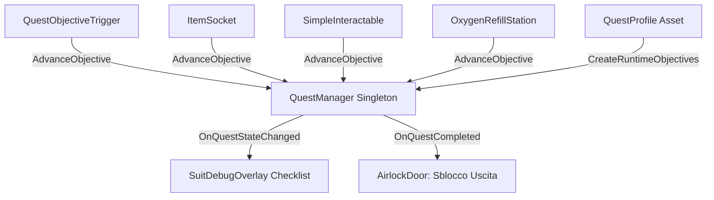

# Quest & Progression System
Ultima verifica: 2026-09-12

## Scopo e confini
Gestisce la progressione degli obiettivi di gioco, la persistenza a runtime dello stato delle missioni e la notifica degli eventi di avanzamento verso altri sistemi di gameplay (come l'apertura delle porte stagne `AirlockDoor`, o l'aggiornamento visivo dell'HUD in `SuitDebugOverlay`).
La struttura si basa su definizioni dichiarative in ScriptableObject (`QuestProfile`) che vengono clonate all'avvio in istanze runtime (`ObjectiveDefinition`) per non sporcare i file asset.

## File e componenti
- `Assets/_Project/Code/Quests/QuestManager.cs`: Singleton orchestratore delle quest attive e degli eventi di completamento.
- `Assets/_Project/Code/Quests/QuestProfile.cs`: ScriptableObject che definisce una sequenza di obiettivi per una missione.
- `ObjectiveDefinition` (classe in `QuestProfile.cs`): DTO serializzabile e clonabile che traccia l'avanzamento (`currentAmount` vs `requiredAmount`).
- `Assets/_Project/Code/Quests/QuestObjectiveTrigger.cs`: Volume trigger che fa avanzare automaticamente un obiettivo quando il giocatore vi entra.

## Dipendenze e flusso dati
- **Trigger e Interazioni**: `ItemSocket`, `SimpleInteractable`, `OxygenRefillStation` e `QuestObjectiveTrigger` chiamano `QuestManager.Instance.AdvanceObjective()`.
- **UI HUD**: `SuitDebugOverlay` osserva `OnQuestStateChanged` per renderizzare l'elenco degli obiettivi spuntati.
- **Porte ed Eventi Ambientali**: `AirlockDoor` osserva `OnQuestCompleted` per sbloccare l'accesso al livello successivo.



## Componenti

### QuestManager
- **Responsabilità e ciclo di vita**:
  - `Awake()`: Configura l'istanza singleton `Instance` (se già presente, distrugge il componente duplicato per preservare il GameObject). Se `activeQuestProfile` è nullo, tenta in editor di caricare `Quest_Objective_1.asset`. Chiama `InitializeQuest()`.
- **Campi Inspector**:
  - `QuestProfile activeQuestProfile`: Profilo missione attivo.
  - `UnityEvent onQuestCompleted`: Evento Unity invocato al completamento di tutti gli obiettivi.
  - `string activeQuestTitle` (debug sola lettura).
  - `bool isQuestCompleted` (debug sola lettura).
  - `List<ObjectiveDefinition> runtimeObjectives` (debug sola lettura).
- **API pubbliche**:
  ```csharp
  static QuestManager Instance { get; }
  string ActiveQuestTitle { get; }
  bool IsQuestCompleted { get; }
  IReadOnlyList<ObjectiveDefinition> RuntimeObjectives { get; }
  UnityEvent onQuestCompleted;
  event Action<QuestManager> OnQuestStateChanged;
  event Action OnQuestCompleted;
  void LoadQuest(QuestProfile profile);
  bool AdvanceObjective(string objectiveId, int amount = 1);
  void SetObjectiveCount(string objectiveId, int amount);
  ```
- **Riferimenti obbligatori e comportamento se mancanti**:
  - Se `activeQuestProfile` è nullo e non viene caricato alcun profilo con `LoadQuest(profile)`, la lista degli obiettivi runtime resta vuota.

### QuestProfile & ObjectiveDefinition
- **Responsabilità e ciclo di vita**:
  - `QuestProfile`: `ScriptableObject` che contiene la definizione immutabile della missione.
- **Campi Inspector di QuestProfile**:
  - `string questId` (default: `"quest_01"`).
  - `string questTitle` (default: `"Obiettivo Principale"`).
  - `string description`: Descrizione narrativa della missione.
  - `List<ObjectiveDefinition> objectives`: Lista degli obiettivi richiesti.
- **Campi di ObjectiveDefinition**:
  - `string objectiveId`: Identificatore univoco stringa (es. `"gen_power"`).
  - `string title`: Testo visualizzato nell'HUD.
  - `string description`: Dettagli dell'obiettivo.
  - `int requiredAmount` (default: `1`): Quantità necessaria per completare l'obiettivo.
  - `int currentAmount`: Quantità accumulata a runtime.
  - `bool IsCompleted => currentAmount >= requiredAmount`.

### QuestObjectiveTrigger
- **Responsabilità e ciclo di vita**:
  - Richiede un `Collider` con `isTrigger = true`.
  - `OnTriggerEnter(Collider other)`: Verifica se il tag corrisponde a `targetTag` e notifica `QuestManager.Instance`.
- **Campi Inspector**:
  - `string targetTag` (default: `"Player"`).
  - `string objectiveId` (default: `"reach_area"`).
  - `int advanceAmount` (default: `1`).
  - `bool triggerOnce` (default: `true`).

## Setup in Unity
1. Creare un GameObject `QuestManager` nella scena e assegnare lo script `QuestManager`.
2. Creare un asset `QuestProfile` (tasto destro -> *Create -> Deeploration -> Quest Profile*).
3. Configurare gli obiettivi (ID univoco, titolo, quantità richiesta).
4. Assegnare l'asset nel campo `Active Profile` di `QuestManager`.

## Configurazione verificata in prefab e scene
- Nella scena `Prototype.unity` (rimossa il 2026-10-07 nel commit `f0fb87b`, recuperabile dalla storia di Git; configurazione non riverificata dopo la rimozione):
  - `Quest_Objective_1.asset` definisce 3 obiettivi:
    1. `"gen_power"`: Celle Generatore (3 richieste).
    2. `"o2_beacon"`: Stazione Ricarica O₂ (1 richiesta).
    3. `"comms_signal"`: Console Comms (1 richiesta).
  - Al completamento di tutti e 3 gli obiettivi, `AirlockDoor` riceve `OnQuestCompleted` e apre la porta della base stagna.

## Sistemi collegati
- [Interaction.md](file:///Z:/_PROJECTS/Unity/Project_Deep/documentation/Interaction.md)
- [Environment.md](file:///Z:/_PROJECTS/Unity/Project_Deep/documentation/Environment.md)
- [SuitFeedback.md](file:///Z:/_PROJECTS/Unity/Project_Deep/documentation/SuitFeedback.md)
