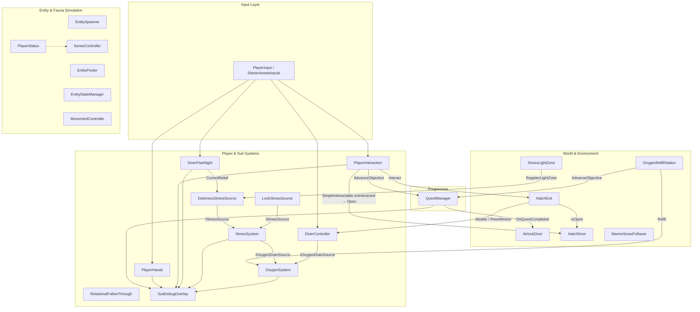

# Project Deep — Indice e Catalogo dell'Architettura del Codice
Ultima verifica: 2026-10-04

Benvenuto nell'hub di documentazione tecnica di *Project Deep / Deeplonauts*.  
Questo catalogo mappa ogni singolo script C# presente nella codebase, definisce i confini dei sistemi, le relazioni tra i componenti e le regole tassative per gli agenti AI e gli sviluppatori.

---

## 1. Struttura della Cartella `Assets/_Project/Code`

La codebase è strutturata in aree funzionali ad alta coesione e basso accoppiamento:

```
Assets/_Project/Code/
├── Editor/                    # Utility e generatori di livello per Unity Editor
├── EntitySystem/              # Simulazione fauna marina autonoma (FSM, Steering, Sensori, Pooler)
│   ├── Core/                  # Pooler, StateManager, EntityStatus, PlayerStatus
│   ├── Debug/                 # Gizmos di debug per entità e player
│   ├── Editor/                # Tooling editor per creazione profili creatura
│   ├── Enums/                 # Tipi di entità, stati, stili di moto
│   ├── Movement/              # Controller di moto, avoidance ostacoli e steering behaviors
│   ├── ScriptableObjects/     # Profili creatura e profilo percezione player
│   ├── Sensors/               # Campo visivo 3D e scansione sensoriale
│   ├── States/                # Implementazioni di IEntityState (Idle, Hunt, Flee, Inspect, Bite, Rest)
│   └── _Documentation/        # Archivio storico (rimando alla documentazione canonica)
├── Environment/               # Oggetti ambientali (paratie, stazioni ricarica O2, neve marina, luci)
├── Interaction/               # Raycast interazione, trasporto oggetti (mani) e alloggiamenti (socket)
├── Player/                    # Sistemi dedicati al Diver e alla tuta da palombaro
│   ├── Camera/                # Lag e follow-through rotazionale per casco e torcia
│   ├── Equipment/             # Torcia subacquea modulare e modalità fascio
│   ├── Feedback/              # HUD di debug/diegetico e controllo vignetta post-processing URP
│   ├── Input/                 # Bridge New Input System e gestione cattura cursore
│   ├── Movement/              # Locomozione pesante stile SOMA, inerzia fondale, head-bob
│   ├── Oxygen/                # Gestione riserva O2, consumo basale e drain da sforzo/stress
│   └── Stress/                # Calcolo ansia da buio (Darkness) e rotazioni brusche (Look)
├── Prologue/                  # Dialoghi, sottotitoli e regia narrativa del prologo
└── Quests/                    # Tracciamento obiettivi, profilo missioni e trigger di avanzamento
```

---

## 2. Catalogo Completo degli Script (66 / 66)

| Script C# (Percorso) | Sistema | Documentazione di Riferimento |
|---|---|---|
| `Assets/_Project/Code/Editor/DeeplonautsLevelBuilder.cs` | Editor Tools | [EditorTools.md](file:///Z:/_PROJECTS/Unity/Project_Deep/documentation/EditorTools.md) |
| `Assets/_Project/Code/Editor/PrologueElevatorSceneBuilder.cs` | Editor Tools | [EditorTools.md](file:///Z:/_PROJECTS/Unity/Project_Deep/documentation/EditorTools.md) |
| `Assets/_Project/Code/Editor/PrologueSmokeCheck.cs` | Editor Tools | [EditorTools.md](file:///Z:/_PROJECTS/Unity/Project_Deep/documentation/EditorTools.md) |
| `Assets/_Project/Code/Editor/PrologueWave1Builder.cs` | Editor Tools | [EditorTools.md](file:///Z:/_PROJECTS/Unity/Project_Deep/documentation/EditorTools.md) |
| `Assets/_Project/Code/EntitySystem/Core/EntityPooler.cs` | Entity System | [EntitySystem.md](file:///Z:/_PROJECTS/Unity/Project_Deep/documentation/EntitySystem.md) |
| `Assets/_Project/Code/EntitySystem/Core/EntityStateManager.cs` | Entity System | [EntitySystem.md](file:///Z:/_PROJECTS/Unity/Project_Deep/documentation/EntitySystem.md) |
| `Assets/_Project/Code/EntitySystem/Core/EntityStatus.cs` | Entity System | [EntitySystem.md](file:///Z:/_PROJECTS/Unity/Project_Deep/documentation/EntitySystem.md) |
| `Assets/_Project/Code/EntitySystem/Core/PlayerStatus.cs` | Entity System | [EntitySystem.md](file:///Z:/_PROJECTS/Unity/Project_Deep/documentation/EntitySystem.md) |
| `Assets/_Project/Code/EntitySystem/Debug/EntityDebugGizmos.cs` | Entity System | [EntitySystem.md](file:///Z:/_PROJECTS/Unity/Project_Deep/documentation/EntitySystem.md) |
| `Assets/_Project/Code/EntitySystem/Debug/PlayerStatusGizmos.cs` | Entity System | [EntitySystem.md](file:///Z:/_PROJECTS/Unity/Project_Deep/documentation/EntitySystem.md) |
| `Assets/_Project/Code/EntitySystem/Editor/CreatureProfileCreator.cs` | Editor Tools | [EditorTools.md](file:///Z:/_PROJECTS/Unity/Project_Deep/documentation/EditorTools.md) |
| `Assets/_Project/Code/EntitySystem/EntitySpawner.cs` | Entity System | [EntitySystem.md](file:///Z:/_PROJECTS/Unity/Project_Deep/documentation/EntitySystem.md) |
| `Assets/_Project/Code/EntitySystem/Enums/EntityEnums.cs` | Entity System | [EntitySystem.md](file:///Z:/_PROJECTS/Unity/Project_Deep/documentation/EntitySystem.md) |
| `Assets/_Project/Code/EntitySystem/Movement/MovementController.cs` | Entity System | [EntitySystem.md](file:///Z:/_PROJECTS/Unity/Project_Deep/documentation/EntitySystem.md) |
| `Assets/_Project/Code/EntitySystem/Movement/ObstacleAvoidance.cs` | Entity System | [EntitySystem.md](file:///Z:/_PROJECTS/Unity/Project_Deep/documentation/EntitySystem.md) |
| `Assets/_Project/Code/EntitySystem/Movement/SteeringBehaviors.cs` | Entity System | [EntitySystem.md](file:///Z:/_PROJECTS/Unity/Project_Deep/documentation/EntitySystem.md) |
| `Assets/_Project/Code/EntitySystem/ScriptableObjects/CreatureProfile.cs` | Entity System | [EntitySystem.md](file:///Z:/_PROJECTS/Unity/Project_Deep/documentation/EntitySystem.md) |
| `Assets/_Project/Code/EntitySystem/ScriptableObjects/PlayerProfile.cs` | Entity System | [EntitySystem.md](file:///Z:/_PROJECTS/Unity/Project_Deep/documentation/EntitySystem.md) |
| `Assets/_Project/Code/EntitySystem/Sensors/SenseController.cs` | Entity System | [EntitySystem.md](file:///Z:/_PROJECTS/Unity/Project_Deep/documentation/EntitySystem.md) |
| `Assets/_Project/Code/EntitySystem/States/BiteState.cs` | Entity System | [EntitySystem.md](file:///Z:/_PROJECTS/Unity/Project_Deep/documentation/EntitySystem.md) |
| `Assets/_Project/Code/EntitySystem/States/FleeState.cs` | Entity System | [EntitySystem.md](file:///Z:/_PROJECTS/Unity/Project_Deep/documentation/EntitySystem.md) |
| `Assets/_Project/Code/EntitySystem/States/HuntState.cs` | Entity System | [EntitySystem.md](file:///Z:/_PROJECTS/Unity/Project_Deep/documentation/EntitySystem.md) |
| `Assets/_Project/Code/EntitySystem/States/IEntityState.cs` | Entity System | [EntitySystem.md](file:///Z:/_PROJECTS/Unity/Project_Deep/documentation/EntitySystem.md) |
| `Assets/_Project/Code/EntitySystem/States/IdleState.cs` | Entity System | [EntitySystem.md](file:///Z:/_PROJECTS/Unity/Project_Deep/documentation/EntitySystem.md) |
| `Assets/_Project/Code/EntitySystem/States/InspectState.cs` | Entity System | [EntitySystem.md](file:///Z:/_PROJECTS/Unity/Project_Deep/documentation/EntitySystem.md) |
| `Assets/_Project/Code/EntitySystem/States/RestState.cs` | Entity System | [EntitySystem.md](file:///Z:/_PROJECTS/Unity/Project_Deep/documentation/EntitySystem.md) |
| `Assets/_Project/Code/Environment/AirlockDoor.cs` | Environment | [Environment.md](file:///Z:/_PROJECTS/Unity/Project_Deep/documentation/Environment.md) |
| `Assets/_Project/Code/Environment/HatchDoor.cs` | Environment | [Environment.md](file:///Z:/_PROJECTS/Unity/Project_Deep/documentation/Environment.md) |
| `Assets/_Project/Code/Environment/HatchExit.cs` | Environment | [Environment.md](file:///Z:/_PROJECTS/Unity/Project_Deep/documentation/Environment.md) |
| `Assets/_Project/Code/Environment/MarineSnowFollower.cs` | Environment | [Environment.md](file:///Z:/_PROJECTS/Unity/Project_Deep/documentation/Environment.md) |
| `Assets/_Project/Code/Environment/OxygenRefillStation.cs` | Environment | [Environment.md](file:///Z:/_PROJECTS/Unity/Project_Deep/documentation/Environment.md) |
| `Assets/_Project/Code/Environment/StressLightZone.cs` | Darkness Stress | [DarknessStress-docs.md](file:///Z:/_PROJECTS/Unity/Project_Deep/documentation/DarknessStress-docs.md) |
| `Assets/_Project/Code/Interaction/IInteractable.cs` | Interaction | [Interaction.md](file:///Z:/_PROJECTS/Unity/Project_Deep/documentation/Interaction.md) |
| `Assets/_Project/Code/Interaction/ItemPickup.cs` | Interaction | [Interaction.md](file:///Z:/_PROJECTS/Unity/Project_Deep/documentation/Interaction.md) |
| `Assets/_Project/Code/Interaction/ItemSocket.cs` | Interaction | [Interaction.md](file:///Z:/_PROJECTS/Unity/Project_Deep/documentation/Interaction.md) |
| `Assets/_Project/Code/Interaction/PlayerHands.cs` | Interaction | [Interaction.md](file:///Z:/_PROJECTS/Unity/Project_Deep/documentation/Interaction.md) |
| `Assets/_Project/Code/Interaction/PlayerInteraction.cs` | Interaction | [Interaction.md](file:///Z:/_PROJECTS/Unity/Project_Deep/documentation/Interaction.md) |
| `Assets/_Project/Code/Interaction/SimpleInteractable.cs` | Interaction | [Interaction.md](file:///Z:/_PROJECTS/Unity/Project_Deep/documentation/Interaction.md) |
| `Assets/_Project/Code/Player/Camera/RotationalFollowThrough.cs` | Camera / Visuals | [CameraFollowThrough.md](file:///Z:/_PROJECTS/Unity/Project_Deep/documentation/CameraFollowThrough.md) |
| `Assets/_Project/Code/Player/Camera/TorchFollowThrough.cs` | Camera / Visuals | [CameraFollowThrough.md](file:///Z:/_PROJECTS/Unity/Project_Deep/documentation/CameraFollowThrough.md) |
| `Assets/_Project/Code/Player/Equipment/DiverFlashlight.cs` | Equipment | [Flashlight.md](file:///Z:/_PROJECTS/Unity/Project_Deep/documentation/Flashlight.md) |
| `Assets/_Project/Code/Player/Feedback/SuitDebugOverlay.cs` | Feedback | [SuitFeedback.md](file:///Z:/_PROJECTS/Unity/Project_Deep/documentation/SuitFeedback.md) |
| `Assets/_Project/Code/Player/Input/StarterAssetsInputs.cs` | Input | [PlayerInput.md](file:///Z:/_PROJECTS/Unity/Project_Deep/documentation/PlayerInput.md) |
| `Assets/_Project/Code/Player/Movement/BasicRigidBodyPush.cs` | Player Movement | [PlayerMovement.md](file:///Z:/_PROJECTS/Unity/Project_Deep/documentation/PlayerMovement.md) |
| `Assets/_Project/Code/Player/Movement/DiverController.cs` | Player Movement | [PlayerMovement.md](file:///Z:/_PROJECTS/Unity/Project_Deep/documentation/PlayerMovement.md) |
| `Assets/_Project/Code/Player/Movement/DiverProfile.cs` | Player Movement | [PlayerMovement.md](file:///Z:/_PROJECTS/Unity/Project_Deep/documentation/PlayerMovement.md) |
| `Assets/_Project/Code/Player/Oxygen/IOxygenDrainSource.cs` | Oxygen | [Oxygen.md](file:///Z:/_PROJECTS/Unity/Project_Deep/documentation/Oxygen.md) |
| `Assets/_Project/Code/Player/Oxygen/OxygenProfile.cs` | Oxygen | [Oxygen.md](file:///Z:/_PROJECTS/Unity/Project_Deep/documentation/Oxygen.md) |
| `Assets/_Project/Code/Player/Oxygen/OxygenSystem.cs` | Oxygen | [Oxygen.md](file:///Z:/_PROJECTS/Unity/Project_Deep/documentation/Oxygen.md) |
| `Assets/_Project/Code/Player/Stress/DarknessStressSource.cs` | Darkness Stress | [DarknessStress-docs.md](file:///Z:/_PROJECTS/Unity/Project_Deep/documentation/DarknessStress-docs.md) |
| `Assets/_Project/Code/Player/Stress/IStressSource.cs` | Stress | [Stress.md](file:///Z:/_PROJECTS/Unity/Project_Deep/documentation/Stress.md) |
| `Assets/_Project/Code/Player/Stress/LookStressSource.cs` | Stress | [Stress.md](file:///Z:/_PROJECTS/Unity/Project_Deep/documentation/Stress.md) |
| `Assets/_Project/Code/Player/Stress/StressProfile.cs` | Stress | [Stress.md](file:///Z:/_PROJECTS/Unity/Project_Deep/documentation/Stress.md) |
| `Assets/_Project/Code/Player/Stress/StressSystem.cs` | Stress | [Stress.md](file:///Z:/_PROJECTS/Unity/Project_Deep/documentation/Stress.md) |
| `Assets/_Project/Code/Prologue/CinematicControlGate.cs` | Prologue | [Prologue.md](file:///Z:/_PROJECTS/Unity/Project_Deep/documentation/Prologue.md) |
| `Assets/_Project/Code/Prologue/ElevatorPrologueSequence.cs` | Prologue | [Prologue.md](file:///Z:/_PROJECTS/Unity/Project_Deep/documentation/Prologue.md) |
| `Assets/_Project/Code/Prologue/PlayerWakeUpSequence.cs` | Prologue | [Prologue.md](file:///Z:/_PROJECTS/Unity/Project_Deep/documentation/Prologue.md) |
| `Assets/_Project/Code/Prologue/SubtitleBehaviour.cs` | Prologue | [Prologue.md](file:///Z:/_PROJECTS/Unity/Project_Deep/documentation/Prologue.md) |
| `Assets/_Project/Code/Prologue/SubtitleClip.cs` | Prologue | [Prologue.md](file:///Z:/_PROJECTS/Unity/Project_Deep/documentation/Prologue.md) |
| `Assets/_Project/Code/Prologue/SubtitleLine.cs` | Prologue | [Prologue.md](file:///Z:/_PROJECTS/Unity/Project_Deep/documentation/Prologue.md) |
| `Assets/_Project/Code/Prologue/SubtitleMixerBehaviour.cs` | Prologue | [Prologue.md](file:///Z:/_PROJECTS/Unity/Project_Deep/documentation/Prologue.md) |
| `Assets/_Project/Code/Prologue/SubtitlePanel.cs` | Prologue | [Prologue.md](file:///Z:/_PROJECTS/Unity/Project_Deep/documentation/Prologue.md) |
| `Assets/_Project/Code/Prologue/SubtitleTrack.cs` | Prologue | [Prologue.md](file:///Z:/_PROJECTS/Unity/Project_Deep/documentation/Prologue.md) |
| `Assets/_Project/Code/Quests/QuestManager.cs` | Quests | [Quests.md](file:///Z:/_PROJECTS/Unity/Project_Deep/documentation/Quests.md) |
| `Assets/_Project/Code/Quests/QuestObjectiveTrigger.cs` | Quests | [Quests.md](file:///Z:/_PROJECTS/Unity/Project_Deep/documentation/Quests.md) |
| `Assets/_Project/Code/Quests/QuestProfile.cs` | Quests | [Quests.md](file:///Z:/_PROJECTS/Unity/Project_Deep/documentation/Quests.md) |

---

## 3. Mappa delle Dipendenze tra Sistemi



---

## 4. Linee Guida per Agenti e Sviluppatori

1. **Lettura Obbligatoria**: Prima di apportare qualsiasi modifica a un sistema, leggere questo file e la reference del sistema corrispondente.
2. **Aggiornamento Simultaneo della Documentazione**: Qualsiasi modifica a campi Inspector, firme API pubbliche, logiche di transizione o contratti d'interfaccia deve essere riflessa nella relativa documentazione Markdown nello stesso turno di lavoro.
3. **Integrità dei Metadati Unity (`.meta`)**: Quando si spostano o rinominano file e cartelle, spostare SEMPRE il relativo file `.meta` mantenendo inalterato il GUID per preservare collegamenti in prefab, scene e profili.
4. **Verifica Automatizzata**: Eseguire `python documentation/check_catalog.py` per validare che ogni script `.cs` sia censito e che tutti i file di documentazione esistano.
