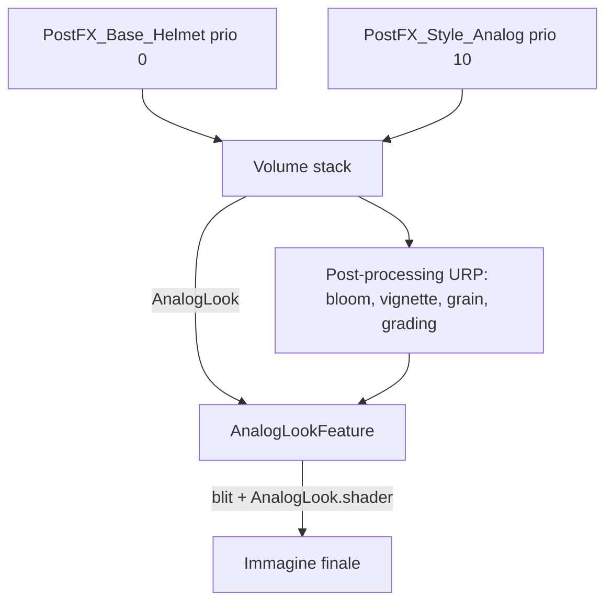

# Rendering — post-processing e finish analogico
Ultima verifica: 2026-10-09

## Scopo e confini
Il look finale del gioco in due strati, entrambi sul Volume stack di URP:
- **A, base "casco"**: sempre attivo. Bloom, vignette, distorsione e aberrazione leggere, grana fine e un lieve grading freddo.
- **B, finish analogico**: opzionale, sopra A. Grana più pesante e, con l'override `AnalogLook`, pixel grossi, posterizzazione con dither Bayer e scanline (riferimento: Iron Lung, Buckshot Roulette).

È una scelta di stile non diegetica (decisa il 2026-10-07): niente lore del visore a telecamere e nessuna meccanica legata al degrado del segnale.

Non coperto: gli shader dell'ambiente (vedi [EnvironmentShading.md](EnvironmentShading.md)) e la vignette dinamica legata allo stress (vedi [SuitFeedback.md](SuitFeedback.md)).

Stato: **implementato e verificato in Play Mode** in `SCN_EnvDemo`. **Pianificato**: confronto per il relatore (solo A contro A+B), eventuale integrazione dei Volume in `SCN_Intro`. In `SCN_Gameplay` i Volume sono configurati ma il look non è ancora verificato in Play Mode.

## File e componenti
- `Assets/_Project/Code/Rendering/AnalogLook.cs`: override di Volume.
- `Assets/_Project/Code/Rendering/AnalogLookFeature.cs`: `ScriptableRendererFeature` che applica l'override.
- `Assets/_Project/Rendering/Shaders/AnalogLook.shader` (`Hidden/Deeplonauts/AnalogLook`): shader a schermo intero.
- `Assets/_Project/Rendering/PostFX/VP_Base_Helmet.asset`: profilo A.
- `Assets/_Project/Rendering/PostFX/VP_Style_Analog.asset`: profilo B.
- `Assets/Settings/PC_Renderer.asset`: contiene l'istanza di `AnalogLookFeature` (accanto a `ScreenSpaceAmbientOcclusion`).

## Dipendenze e flusso dati
In scena due GameObject con `Volume` globale: `PostFX_Base_Helmet` (profilo A, priorità 0) e `PostFX_Style_Analog` (profilo B, priorità 10). B ha priorità maggiore, quindi **per gli override che definisce sostituisce A, non si somma**. Disattivando il GameObject `PostFX_Style_Analog` resta solo A.

`AnalogLookFeature` accoda il pass `AfterRenderingPostProcessing` solo se la camera ha il post-processing attivo e `AnalogLook.IsActive()` (override attivo e `intensity > 0`). Il pass usa Render Graph: legge `activeColorTexture`, lo copia con il materiale in una texture temporanea e la imposta come `cameraColor`. Se il target attivo è il back buffer il pass non fa nulla.

## Componenti

### AnalogLook
- Responsabilità: parametri del finish analogico, `[VolumeComponentMenu("Deeplonauts/Analog Look")]`.
- Campi Inspector:

| Campo | Tipo | Default | Significato |
|---|---|---|---|
| `intensity` | `ClampedFloatParameter` 0–1 | 0 | Miscela tra immagine originale e finish; 0 spegne l'effetto |
| `pixelSize` | `ClampedFloatParameter` 1–8 | 3 | Lato del pixel virtuale a 1080p; scala con l'altezza del target e viene arrotondato a intero |
| `colorLevels` | `ClampedIntParameter` 2–64 | 12 | Livelli per canale colore |
| `dither` | `ClampedFloatParameter` 0–1 | 1 | Forza del dither ordinato Bayer 4×4 |
| `scanlines` | `ClampedFloatParameter` 0–1 | 0.15 | Oscuramento delle righe alterne |

- API pubbliche: `public bool IsActive()`.
- Riferimenti: nessuno; è un dato letto dal Volume stack.

### AnalogLookFeature
- Responsabilità: inserire il pass nel renderer.
- Ciclo di vita: `Create()` carica lo shader (`Hidden/Deeplonauts/AnalogLook` se il campo è vuoto) e crea il materiale; `AddRenderPasses()` accoda il pass se serve; `Dispose()` distrugge il materiale.
- Campi Inspector: `shader` (`Shader`, default `null` → `Shader.Find`), `passEvent` (`RenderPassEvent`, default `AfterRenderingPostProcessing`).
- API pubbliche: gli override di `ScriptableRendererFeature`.
- Riferimenti obbligatori: lo shader. Se non viene trovato (non incluso in una build) la feature non fa nulla senza errori.

## Setup in Unity
1. `PC_Renderer` → Add Renderer Feature → `AnalogLookFeature` (già presente).
2. Una scena con due Volume globali: A a priorità 0, B a priorità 10, con i profili in `Assets/_Project/Rendering/PostFX/`.
3. La camera deve avere il post-processing attivo.
4. Il profilo B contiene l'override `Analog Look` con `intensity` 1.

Valori dei profili al 2026-10-07 (misurati con una luminosità media pari a quella della scena prima dei filtri, entro il 3%):
- A: contrasto 0, saturazione −10, post exposure +0.11, vignette 0.24, lens distortion 0.12, aberrazione cromatica 0.12, grana `Thin1` 0.2, split toning con ombre ciano.
- B: contrasto 5, saturazione −40, post exposure +0.52, vignette 0.32, aberrazione cromatica 0.35, grana `Medium3` 0.6; `Analog Look` con pixel 3, 24 livelli, dither 0.6, scanline 0.15.

## Configurazione verificata in prefab e scene
`SCN_EnvDemo`: i due Volume sopra, con i due `Global Volume` originali (solo Bloom e solo Vignette) disattivati ma non cancellati.

`SCN_Gameplay` (al 2026-10-09): gli stessi due Volume (`PostFX_Base_Helmet` priorità 0, `PostFX_Style_Analog` priorità 10); i vecchi Volume globali sono stati rimossi. Camera e luci allineate a `SCN_EnvDemo`: sfondo a tinta unita uguale al colore della nebbia (0, 0.057, 0.113) al posto dello skybox procedurale, nebbia Exponential Squared con densità 0.065, Directional Light a 0.03. Far clip della camera del player a 800, per tenere nel frustum la torre-landmark a circa 600 m (vedi [Landmark.md](Landmark.md)).

`SCN_Intro` non usa ancora questi profili.

## Estensione del sistema
- Altre varianti di stile: un nuovo profilo con priorità maggiore di A.
- Per un'esposizione che non si sommi in modo inatteso ricordare che l'override di priorità maggiore sostituisce quello di A.

## Limiti e problemi noti
- Il pixel virtuale è arrotondato a intero: a risoluzioni che non sono multipli di 1080 le celle sono comunque uniformi, ma la dimensione effettiva può differire da quella impostata.
- Le righe verticali molto deboli osservate in Play Mode anche con solo A sono forse dovute a `LensDistortion` con certe risoluzioni della Game View: **non verificato**.
- La posterizzazione schiaccia le ombre: con `colorLevels` bassi il buio perde gradazioni. 24 livelli è il compromesso corrente.
- `Camera.Render` da script nell'Editor fermo non rende la torcia: le catture per giudicare il look vanno fatte in Play Mode.
- Il confronto tra A e A+B per il relatore non è ancora catturato.

## Verifica
Eseguita il 2026-10-07 in Unity 6000.3.19f1 (URP 17.3.0):
- compilazione senza errori, shader senza messaggi;
- primo render con celle non intere: strisce verticali; corretto arrotondando il pixel, rivisto dopo il merge;
- Game View in Play Mode con A+B e con solo A: entrambi leggibili, rocce e neve marina distinguibili con la posterizzazione accesa.

## Sistemi collegati
- [EnvironmentShading.md](EnvironmentShading.md): shader che questi effetti elaborano.
- [Landmark.md](Landmark.md): torre visibile nella nebbia e luci di segnalazione.
- [Environment.md](Environment.md): neve marina.
- [SuitFeedback.md](SuitFeedback.md): vignette dinamica dello stress.
