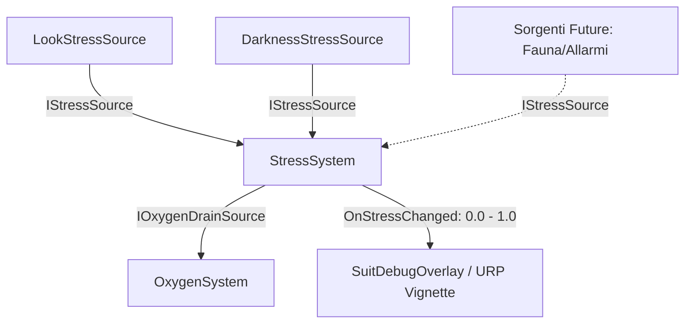

# Stress System
Ultima verifica: 2026-09-12

## Scopo e confini
Simula lo stato psicologico e di ansia del diver negli abissi. Lo stress si accumula quando il giocatore è esposto a fattori di disturbo (buio pesto, isolamento, movimenti repentini e convulsivi della visuale, prossimità di predatori) e si riduce quando si trova in zone sicure illuminate o mantiene la calma.
Oltre a guidare i feedback sensoriali (vignetta URP, respiro), lo stress implementa `IOxygenDrainSource`: un diver in iperventilazione o panico consuma una quota significativamente superiore di ossigeno.

## File e componenti
- `Assets/_Project/Code/Player/Stress/StressSystem.cs`: Aggregatore principale dello stress, gestore del recovery e provider di drain O₂.
- `Assets/_Project/Code/Player/Stress/StressProfile.cs`: ScriptableObject con i parametri di soglia, capacità massima, recovery e drain O₂.
- `Assets/_Project/Code/Player/Stress/IStressSource.cs`: Interfaccia contrattuale per qualsiasi sorgente di stress in unità/secondo.
- `Assets/_Project/Code/Player/Stress/LookStressSource.cs`: Componente che rileva rotazioni brusche e agitate della visuale (panico da orientamento).
- `Assets/_Project/Code/Player/Stress/DarknessStressSource.cs`: Sorgente di stress causata dal buio abissale (documentata nel dettaglio in [DarknessStress-docs.md](file:///Z:/_PROJECTS/Unity/Project_Deep/documentation/DarknessStress-docs.md)).

## Dipendenze e flusso dati
- **Sorgenti di Stress**: `StressSystem` scopre automaticamente tramite `GetComponentsInChildren<IStressSource>(true)` i moduli presenti (es. `LookStressSource`, `DarknessStressSource`) o accetta registrazioni a runtime.
- **Ossigeno**: `StressSystem` implementa `IOxygenDrainSource` e viene interrogato da `OxygenSystem`.
- **Feedback**: Notifica `OnStressChanged` (normalizzato 0-1) a `SuitDebugOverlay` per modulare la vignetta post-processing e i parametri vitali a schermo.



## Componenti

### StressSystem
- **Responsabilità e ciclo di vita**:
  - `Awake()`: Validazione `StressProfile`, cache automatica di tutte le sorgenti `IStressSource` nei figli.
  - `Update()`: Somma il contributo istantaneo delle sorgenti (`currentStressPerSecond`). Se il totale supera la costante `STRESS_ACCUMULATION_THRESHOLD` (0.05f), incrementa `currentStress`. Altrimenti, applica il decadimento naturale (`-profile.recoveryPerSecond * Time.deltaTime`).
- **Campi Inspector**:
  - `StressProfile profile`: Asset di configurazione.
  - `float currentStress` (debug sola lettura): Valore assoluto di stress accumulato.
  - `float currentStressPerSecond` (debug sola lettura): Tasso istantaneo di stress in arrivo dalle sorgenti.
- **API pubbliche**:
  - `event Action<float> OnStressChanged`: Invocato quando il valore normalizzato cambia.
  - `float CurrentStress { get; }`: Valore assoluto.
  - `float MaxStress { get; }`: Capacità massima definita dal profilo.
  - `float NormalizedStress { get; }`: Rapporto `currentStress / profile.maxStress` (0.0 - 1.0).
  - `float CurrentStressPerSecond { get; }`: Tasso di accumulo attuale.
  - `void RegisterSource(IStressSource source)`: Registra una nuova sorgente.
  - `void UnregisterSource(IStressSource source)`: Disiscrive una sorgente.
  - `float GetOxygenDrainPerSecond()`: Restituisce `NormalizedStress * profile.maxOxygenDrainPerSecond`.
- **Riferimenti obbligatori e comportamento se mancanti**:
  - `profile`: Se assente, logga `Debug.LogError` e disabilita il componente.

### StressProfile
- **Responsabilità e ciclo di vita**:
  - `ScriptableObject` che definisce i limiti e le reazioni psicofisiche del diver.
- **Campi Inspector**:
  - `float maxStress` (default: `100f`): Livello massimo di stress oltre il quale si è al culmine del panico.
  - `float recoveryPerSecond` (default: `6f`): Velocità di smaltimento dello stress in condizioni sicure.
  - `float maxOxygenDrainPerSecond` (default: `2f`): Consumo addizionale massimo di O₂ generato dallo stress al 100%.
  - `float agitationThreshold` (default: `60f` gradi/s): Soglia di velocità angolare della testa sopra la quale scatta lo stress.
  - `float fullAgitationSpeed` (default: `180f` gradi/s): Velocità angolare per cui si ottiene il 100% dello stress da sguardo.
  - `float stressAtFullAgitationPerSecond` (default: `12f`): Tasso di stress generato a velocità angolare massima.
  - `float angularVelocitySmoothing` (default: `12f`): Smorzamento della velocità angolare calcolata.

### LookStressSource
- **Responsabilità e ciclo di vita**:
  - `[DefaultExecutionOrder(-50)]` per garantire che il campionamento della rotazione avvenga in modo coerente.
  - `Awake()`: Memorizza `previousRotation` di `lookTarget`.
  - `Update()`: Calcola la derivata temporale della rotazione angolare (`Quaternion.Angle`), la smorza esponenzialmente e usa `Mathf.InverseLerp` tra `agitationThreshold` e `fullAgitationSpeed` per calcolare lo stress al secondo.
- **Campi Inspector**:
  - `StressProfile profile`: Riferimento alle soglie di agitazione.
  - `Transform lookTarget`: Target della visuale da monitorare (solitamente la camera o il camera root).
  - `float angularVelocity` (debug sola lettura).
  - `float stressPerSecond` (debug sola lettura).
- **API pubbliche**:
  - `float GetStressPerSecond()`: Restituisce il valore calcolato se il componente è abilitato, altrimenti `0f`.

### IStressSource
- **Interfaccia**:
  ```csharp
  public interface IStressSource
  {
      float GetStressPerSecond();
  }
  ```

## Setup in Unity
1. Aggiungere `StressSystem` sulla capsula del player.
2. Assegnare un asset `StressProfile`.
3. Aggiungere `LookStressSource` e `DarknessStressSource` su GameObject figli o sullo stesso GameObject.
4. Assegnare a `LookStressSource` il Transform del `PlayerCameraRoot`.

## Configurazione verificata in prefab e scene
- In [Player.prefab](file:///Z:/_PROJECTS/Unity/Project_Deep/Assets/_Project/Prefabs/Player.prefab):
  - `StressSystem` è agganciato al player con profilo calibrato.
  - `LookStressSource` e `DarknessStressSource` sono integrati e operano in sinergia.

## Estensione del sistema
- Integrazione audio affanno: modulare il pitch e la frequenza delle tracce audio del respiro in base a `NormalizedStress`.
- Proximity stress da predatori: creare un `CreatureProximityStressSource` che implementa `IStressSource` e legge i predatori dal `SenseController` / collider di prossimità.

## Sistemi collegati
- [DarknessStress-docs.md](file:///Z:/_PROJECTS/Unity/Project_Deep/documentation/DarknessStress-docs.md)
- [Oxygen.md](file:///Z:/_PROJECTS/Unity/Project_Deep/documentation/Oxygen.md)
- [Flashlight.md](file:///Z:/_PROJECTS/Unity/Project_Deep/documentation/Flashlight.md)
- [SuitFeedback.md](file:///Z:/_PROJECTS/Unity/Project_Deep/documentation/SuitFeedback.md)
