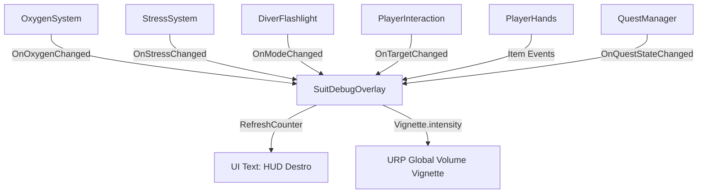

# Suit Feedback & Debug Overlay
Ultima verifica: 2026-09-12

## Scopo e confini
Rappresenta l'anello di congiunzione tra le letture dei sistemi interni della tuta (`OxygenSystem`, `StressSystem`, `DiverFlashlight`), le interazioni fisiche (`PlayerHands`, `PlayerInteraction`), la progressione narrativa (`QuestManager`) e i canali percettivi del giocatore.
Attualmente gestisce:
1. Il rendering dell'HUD di testo informativo (ancorato nell'angolo superiore destro del display).
2. Il feedback visivo a tutto schermo tramite post-processing URP, controllando direttamente l'intensità della `Vignette` nel `VolumeProfile` in base al livello normalizzato di stress.

## File e componenti
- `Assets/_Project/Code/Player/Feedback/SuitDebugOverlay.cs`: Controller unificato di feedback diegetico/debug e post-processing URP.

## Dipendenze e flusso dati
- **Tuta e Vitali**: Sottoscrive `OnOxygenChanged` (`OxygenSystem`), `OnStressChanged` (`StressSystem`), `OnModeChanged` (`DiverFlashlight`).
- **Interazione e Mani**: Sottoscrive `OnTargetChanged` (`PlayerInteraction`) e `OnItemPickedUp`/`OnItemDropped` (`PlayerHands`).
- **Missioni**: Sottoscrive `OnQuestStateChanged` (`QuestManager`).
- **Rendering URP**: Modifica `Vignette.intensity.value` sul componente `Volume` della scena.

## Componenti

### SuitDebugOverlay
- **Responsabilità e ciclo di vita**:
  - `Awake()`: Auto-scoperta delle dipendenze mancanti via `FindFirstObjectByType` (`OxygenSystem`, `StressSystem`, `DiverFlashlight`, `PlayerInteraction`, `PlayerHands`, `QuestManager.Instance`). Configura il `Text` su `VerticalWrapMode.Overflow` / `HorizontalWrapMode.Overflow`. Recupera la `Vignette` dal `VolumeProfile` e ne forza `overrideState = true`.
  - `OnEnable()` / `OnDisable()`: Registrazione e disiscrizione da tutti gli eventi dei sistemi collegati per evitare memory leak.
  - `Update()`: Interpola lo stress visualizzato (`displayedStress`) con risposta esponenziale indipendente dal frame rate (`1f - Mathf.Exp(-vignetteResponse * Time.deltaTime)`), calcola l'intensità della vignetta tra `minimumVignetteIntensity` e `maximumVignetteIntensity`, e aggiorna il testo dell'HUD.
- **Campi Inspector**:
  - **Sistemi Tuta**:
    - `OxygenSystem oxygen`: Riferimento al serbatoio O₂.
    - `StressSystem stress`: Riferimento al monitor dello stress.
    - `DiverFlashlight flashlight`: Riferimento alla torcia.
    - `PlayerInteraction interaction`: Riferimento al raycast delle interazioni.
    - `PlayerHands hands`: Riferimento all'inventario delle mani.
    - `QuestManager questManager`: Riferimento al tracciamento obiettivi.
  - **UI**:
    - `Text counter`: Componente Text (uGUI) per la stampa del testo informativo.
  - **Feedback Vignetta URP**:
    - `Volume volume`: Riferimento al `Global Volume` con profilo post-processing URP.
    - `float minimumVignetteIntensity` (range: 0-1, default: `0.2f`): Intensità della vignetta a riposo (stress 0%).
    - `float maximumVignetteIntensity` (range: 0-1, default: `0.4f`): Intensità della vignetta al culmine del panico (stress 100%).
    - `float vignetteResponse` (range: 1-20, default: `7f`): Reattività dell'effetto visivo.
- **API pubbliche**:
  - Il componente non espone API pubbliche di manipolazione diretta, operando in modalità Observer / Consumer su eventi.
- **Riferimenti obbligatori e comportamento se mancanti**:
  - Tutti i riferimenti ai sistemi della tuta prevedono fallback automatico in `Awake()`. Se `volume` o `vignette` sono assenti, la regolazione post-processing viene semplicemente ignorata senza eccezioni.

## Layout e Contenuto dell'HUD a Schermo
1. **Parametri Vitali**:
   - `O₂  XX.X%`
   - `STRESS  XX%`
   - `TORCH  [FULL / LOW / OFF]` (mostra il singolo stato corrente della torcia in maiuscolo, oppure `[N/A]` se il riferimento a `DiverFlashlight` non è presente)
2. **Stato Oggetto Trasportato**:
   - `MANI: [NOME_OGGETTO] (Premi G per lasciare)` in verde quando occupate.
3. **Checklist Missione**:
   - `-- TITOLO MISSIONE --`
   - `[x] / [ ] Descrizione Obiettivo (corrente/richiesto)` in giallo/verde.
4. **Prompt Interazione Contestuale**:
   - `>> [E] Azione <<` in celeste quando si punta un oggetto interattivo.

## Setup in Unity
1. Aggiungere `SuitDebugOverlay` su un GameObject canvas dedicato o sul Player.
2. Collegare il componente `Text` (ancorato in alto a destra, `Anchor Max: (1, 1)`, `Pivot: (1, 1)`, allineamento a destra).
3. Trascinare il `Global Volume` della scena nel campo `Volume`.

## Configurazione verificata in prefab e scene
- In [Player.prefab](file:///Z:/_PROJECTS/Unity/Project_Deep/Assets/_Project/Prefabs/Player.prefab):
  - Il testo dell'HUD è allineato nell'angolo superiore destro con margine di 24 px.
  - Il `Volume` post-processing è agganciato al profilo globale con `Vignette` attiva.

## Estensione del sistema
- Sostituzione con HUD diegetico: proiettare le stringhe o i valori numerici su display all'interno della visiera 3D del casco del diver anziché sul canvas a schermo.

## Limiti e problemi noti
- Se il `VolumeProfile` non include un override `Vignette`, `profile.TryGet(out vignette)` restituirà `false` e la vignetta non verrà pilotata.

## Sistemi collegati
- [Oxygen.md](file:///Z:/_PROJECTS/Unity/Project_Deep/documentation/Oxygen.md)
- [Stress.md](file:///Z:/_PROJECTS/Unity/Project_Deep/documentation/Stress.md)
- [Flashlight.md](file:///Z:/_PROJECTS/Unity/Project_Deep/documentation/Flashlight.md)
- [Interaction.md](file:///Z:/_PROJECTS/Unity/Project_Deep/documentation/Interaction.md)
- [Quests.md](file:///Z:/_PROJECTS/Unity/Project_Deep/documentation/Quests.md)
